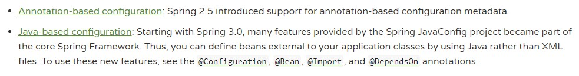
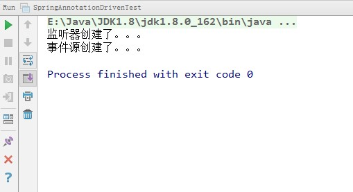
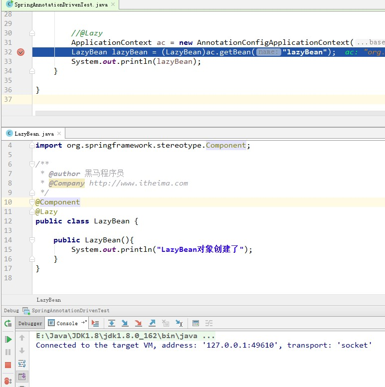
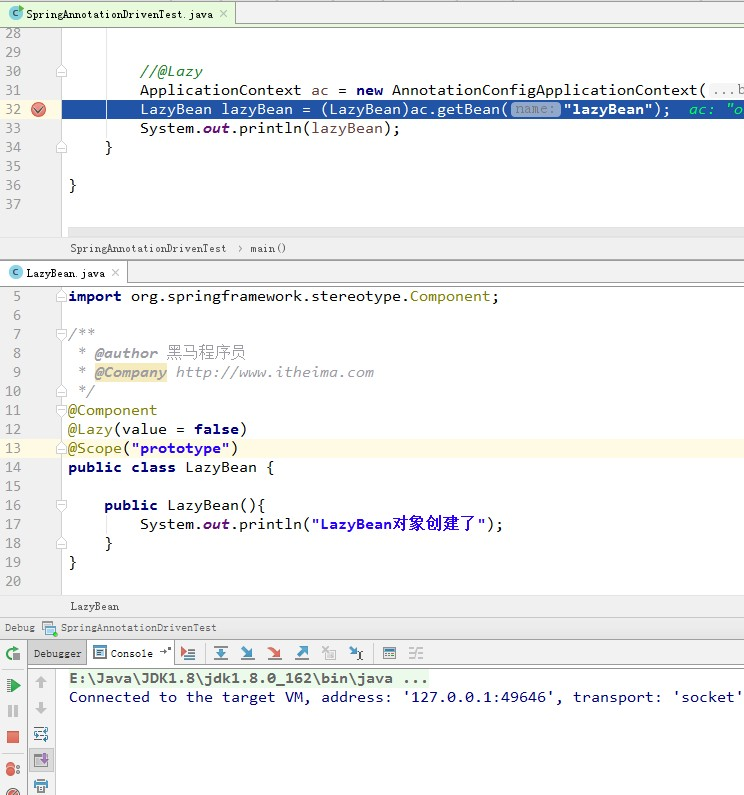
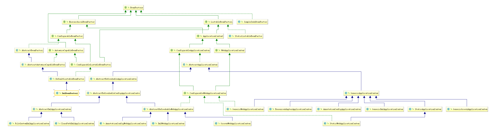
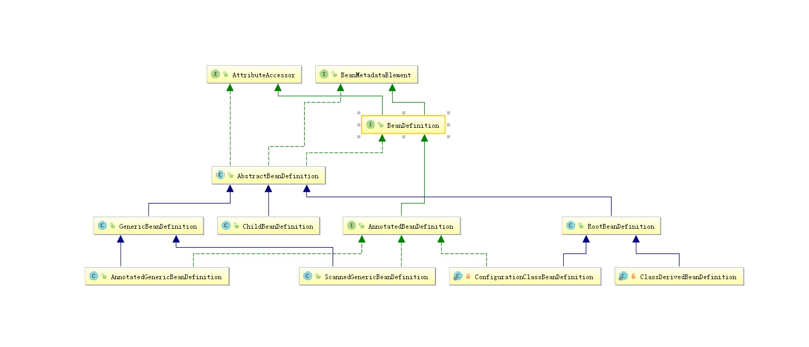
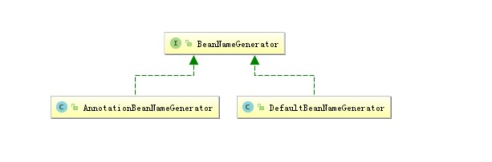
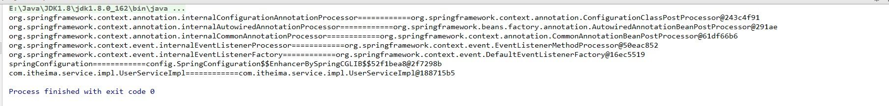
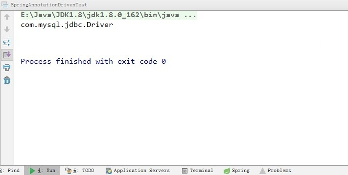
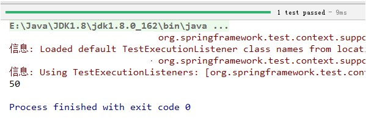

# 第一部分：Spring的IOC

## 一、設計模式-工廠模式

```tex
    工廠模式是我們最常用的例項化物件模式了，它是用工廠中的方法代替new建立物件的一種設計模式。
    我們以Mybatis的SqlSession介面為例，它有一個實現類DefaultSqlSession，如果我們要建立該介面的例項物件:SqlSession sqlSession=new DefaultSqlSession();
    可是，實際情況是，通常我們都要在建立SqlSession例項時做點初始化的工作,比如解析XML,封裝連線資料庫的資訊等等。
     在建立物件時，如果有一些不得不做的初始化操作時，我們首先到的是，可以使用建構函式，這樣生成例項就寫成:SqlSession sqlSession=new DefaultSqlSession(傳入配置檔案的路徑);
     但是，如果建立sqlSession例項時所做的初始化工作不是像賦值這樣簡單的事，可能是很長一段程式碼，如果也寫入建構函式中，那你的程式碼很難看了（就需要Refactor重構）。
     為什麼說程式碼很難看，初學者可能沒有這種感覺，我們分析如下，初始化工作如果是很長一段程式碼，說明要做的工作很多，將很多工作裝入一個方法中，相當於將很多雞蛋放在一個籃子裡，是很危險的，這也是有悖於Java物件導向的原則，物件導向的封裝(Encapsulation)和分派(Delegation)告訴我們，儘量將長的程式碼分派“切割”成每段，將每段再“封裝”起來(減少段和段之間耦合聯絡性)，這樣，就會將風險分散，以後如果需要修改，只要更改每段，不會再發生牽一動百的事情。
	所以，Mybatis框架在使用時為我們提供了SqlSessionFactory工廠類，通過方法獲取到SqlSession物件。同時方法有很多過載，用於實現不同的需求。這個方法就是openSession()，它支援傳入Connection引數來保證連線的一致性；支援傳入true|false來保證事務的提交時機等等。
```

## 二、IOC和DI

### 1、IOC-Inversion of Control

```tex
    它的含義為：控制反轉。它不是一個技術，而是一種思想。其作用是用於削減程式碼間的耦合。它的實現思想就是利用了工廠設計模式，把建立物件程式碼從具體類中剝離出去，交由工廠來完成，從而降低程式碼間的依賴關係。
    耦合有如下分類：
   		（1） 內容耦合。當一個模組直接修改或操作另一個模組的資料時，或一個模組不通過正常入口而轉入另一個模組時，這樣的耦合被稱為內容耦合。內容耦合是最高程度的耦合，應該避免使用之。
		（2） 公共耦合。兩個或兩個以上的模組共同引用一個全域性資料項，這種耦合被稱為公共耦合。在具有大量公共耦合的結構中，確定究竟是哪個模組給全域性變數賦了一個特定的值是十分困難的。
		（3） 外部耦合 。一組模組都訪問同一全域性簡單變數而不是同一全域性資料結構，而且不是通過參數列傳遞該全域性變數的資訊，則稱之為外部耦合。
		（4） 控制耦合 。一個模組通過介面向另一個模組傳遞一個控制訊號，接受訊號的模組根據訊號值而進行適當的動作，這種耦合被稱為控制耦合。
		（5） 標記耦合 。若一個模組A通過介面向兩個模組B和C傳遞一個公共引數，那麼稱模組B和C之間存在一個標記耦合。
		（6） 資料耦合。模組之間通過引數來傳遞資料，那麼被稱為資料耦合。資料耦合是最低的一種耦合形式，系統中一般都存在這種型別的耦合，因為為了完成一些有意義的功能，往往需要將某些模組的輸出資料作為另一些模組的輸入資料。
		（7） 非直接耦合 。兩個模組之間沒有直接關係，它們之間的聯絡完全是通過主模組的控制和呼叫來實現的。
	為什麼要解耦：
		耦合是影響軟體複雜程度和設計質量的一個重要因素，在設計上我們應採用以下原則：如果模組間必須存在耦合，就儘量使用資料耦合，少用控制耦合，限制公共耦合的範圍，儘量避免使用內容耦合。  	
```

### 2、DI-Dependency Injection 依賴注入

```tex
    它的全稱是依賴注入。是spring框架核心ioc的具體實現。
	舉例說明：我們的程式在編寫時，通過控制反轉，把物件的建立交給了spring，但是程式碼中不可能出現沒有依賴的情況。ioc解耦只是降低他們的依賴關係，但不會消除。例如：我們的業務層仍會呼叫持久層的方法。
那這種業務層和持久層的依賴關係，在使用spring之後，就讓spring來維護了。
	簡單的說，就是坐等框架把持久層物件傳入業務層，而不用我們自己去獲取。
```

## 三、Spring註解驅動開發入門

### 1、寫在最前

```
spring在2.5版本引入了註解配置的支援，同時從Spring 3版本開始，Spring JavaConfig專案提供的許多特性成為核心Spring框架的一部分。因此，可以使用Java而不是XML檔案來定義應用程式類外部的bean。在這裡面官方文件為我們提供了四個基本註解@Configuration,@Bean,@Import,@DependsOn
```



### 2、註解驅動入門案例介紹

```
1.需求：
	實現儲存一條資料到資料庫。
2.表結構：
	create table account(
		id int primary key auto_increment,
		name varchar(50),
		money double(7,2)
	);
3.要求：
	使用spring框架中的JdbcTemplate和DriverManagerDataSource
	使用純註解配置spring的ioc	
```

### 3、案例實現

#### 3.1、匯入座標

```xml
<dependencies>
        <dependency>
            <groupId>org.springframework</groupId>
            <artifactId>spring-context</artifactId>
            <version>5.1.6.RELEASE</version>
        </dependency>
        <dependency>
            <groupId>org.springframework</groupId>
            <artifactId>spring-jdbc</artifactId>
            <version>5.1.6.RELEASE</version>
        </dependency>
        <dependency>
            <groupId>mysql</groupId>
            <artifactId>mysql-connector-java</artifactId>
            <version>5.1.45</version>
        </dependency>
    </dependencies>
```

#### 3.2、編寫配置類

```java
/**
 * spring的配置類
 * 用於替代xml配置
 * @author 黑馬程式設計師
 * @Company http://www.itheima.com
 */
@Configuration
@Import(JdbcConfig.class)
@PropertySource("classpath:jdbc.properties")
public class SpringConfiguration {
}


/**
 * 連線資料庫的配置
 * @author 黑馬程式設計師
 * @Company http://www.itheima.com
 */
public class JdbcConfig {

    @Value("${jdbc.driver}")
    private String driver;
    @Value("${jdbc.url}")
    private String url;
    @Value("${jdbc.username}")
    private String username;
    @Value("${jdbc.password}")
    private String password;


    @Bean("jdbcTemplate")
    public JdbcTemplate createJdbcTemplate(DataSource dataSource){
        return new JdbcTemplate(dataSource);
    }


    @Bean("dataSource")
    public DataSource createDataSource(){
        DriverManagerDataSource dataSource = new DriverManagerDataSource();
        dataSource.setDriverClassName(driver);
        dataSource.setUrl(url);
        dataSource.setUsername(username);
        dataSource.setPassword(password);
        return dataSource;
    }
}
```

#### 3.3、編寫配置檔案

```tex
jdbc.driver=com.mysql.jdbc.Driver
jdbc.url=jdbc:mysql://localhost:3306/spring_day01
jdbc.username=root
jdbc.password=1234
```

#### 3.4、編寫測試類

```java
/**
 * @author 黑馬程式設計師
 * @Company http://www.itheima.com
 */
public class SpringAnnotationDrivenTest {

    /**
     * 測試
     * @param args
     */
    public static void main(String[] args) {
        //1.獲取容器
        ApplicationContext ac = new AnnotationConfigApplicationContext(SpringConfiguration.class);
        //2.根據id獲取物件
        JdbcTemplate jdbcTemplate = ac.getBean("jdbcTemplate",JdbcTemplate.class);
        //3.執行操作
        jdbcTemplate.update("insert into account(name,money)values(?,?)","test",12345);
    }
}
```

## 四、IOC的常用註解分析

### 1、用於註解驅動的註解

#### 1.1、@Configuration

##### 1.1.1、原始碼

```java
@Target(ElementType.TYPE)
@Retention(RetentionPolicy.RUNTIME)
@Documented
@Component
public @interface Configuration {

	/**
	 * Explicitly specify the name of the Spring bean definition associated with the
	 * {@code @Configuration} class. If left unspecified (the common case), a bean
	 * name will be automatically generated.
	 * <p>The custom name applies only if the {@code @Configuration} class is picked
	 * up via component scanning or supplied directly to an
	 * {@link AnnotationConfigApplicationContext}. If the {@code @Configuration} class
	 * is registered as a traditional XML bean definition, the name/id of the bean
	 * element will take precedence.
	 * @return the explicit component name, if any (or empty String otherwise)
	 * @see org.springframework.beans.factory.support.DefaultBeanNameGenerator
	 */
	@AliasFor(annotation = Component.class)
	String value() default "";
}
```

##### 1.1.2、說明

```tex
作用：
	它是在spring3.0版本之後加入的。此註解是spring支援註解驅動開發的一個標誌。表明當前類是spring的一個配置類，作用是替代spring的applicationContext.xml。但其本質就是@Component註解，被此註解修飾的類，也會被存入spring的ioc容器。
屬性：
	value:
		用於存入spring的Ioc容器中Bean的id。
使用場景：
	在註解驅動開發時，用於編寫配置的類，通常可以使用此註解。一般情況下，我們的配置也會分為主從配置，@Configuration一般出現在主配置類上。例如，入門案例中的SpringConfiguration類上。值得注意的是，如果我們在註解驅動開發時，構建ioc容器使用的是傳入位元組碼的建構函式，此註解可以省略。但是如果傳入的是一個包，此註解則不能省略。
```

##### 1.1.3、示例

```java
	在註解驅動的入門案例中，由於沒有了applicationContext.xml，就沒法在xml中配置spring建立容器要掃描的包了。那麼，我們自己寫的一些類，通過註解配置到ioc容器中也無法實現了。此時就可以使用此註解來代替spring的配置檔案。
/**
 * spring的配置類
 * 用於替代xml配置
 * @author 黑馬程式設計師
 * @Company http://www.itheima.com
 */
@Configuration
@Import(JdbcConfig.class)
@PropertySource("classpath:jdbc.properties")
@ComponentScan("com.itheima")
public class SpringConfiguration {
}
```

#### 1.2、@ComponentScan

##### 1.2.1、原始碼

```java
@Retention(RetentionPolicy.RUNTIME)
@Target(ElementType.TYPE)
@Documented
@Repeatable(ComponentScans.class)
public @interface ComponentScan {
	/**
	 */
	@AliasFor("basePackages")
	String[] value() default {};

  	/**
	 */
	@AliasFor("value")
	String[] basePackages() default {};

  	/**
	 */
	Class<?>[] basePackageClasses() default {};

  	/**
	 */
	Class<? extends BeanNameGenerator> nameGenerator() default BeanNameGenerator.class;

  	/**
	 */
	Class<? extends ScopeMetadataResolver> scopeResolver() default AnnotationScopeMetadataResolver.class;

  	/**
	 */
	ScopedProxyMode scopedProxy() default ScopedProxyMode.DEFAULT;

  	/**
	 */
	String resourcePattern() default ClassPathScanningCandidateComponentProvider.DEFAULT_RESOURCE_PATTERN;

  	/**
	 */
	boolean useDefaultFilters() default true;

  	/**
	 */
	Filter[] includeFilters() default {};

  	/**
	 */
	Filter[] excludeFilters() default {};

  	/**
	 */
	boolean lazyInit() default false;


	/**
	 * Declares the type filter to be used as an {@linkplain ComponentScan#includeFilters
	 * include filter} or {@linkplain ComponentScan#excludeFilters exclude filter}.
	 */
	@Retention(RetentionPolicy.RUNTIME)
	@Target({})
	@interface Filter {
		/**
		 */
		FilterType type() default FilterType.ANNOTATION;

		/**
		 */
		@AliasFor("classes")
		Class<?>[] value() default {};
      
		/**
		 */
		@AliasFor("value")
		Class<?>[] classes() default {};
      
		/**
		 */
		String[] pattern() default {};
	}
}
```

##### 1.2.2、說明

```
作用：
	用於指定建立容器時要掃描的包。該註解在指定掃描的位置時，可以指定包名，也可以指定掃描的類。同時支援定義掃描規則，例如包含哪些或者排除哪些。同時，它還支援自定義Bean的命名規則
屬性：
	value:
		用於指定要掃描的包。當指定了包的名稱之後，spring會掃描指定的包及其子包下的所有類。
	basePackages:
		它和value作用是一樣的。
	basePackageClasses:
		指定具體要掃描的類的位元組碼。
	nameGenrator:
		指定掃描bean物件存入容器時的命名規則。詳情請參考第五章第4小節的BeanNameGenerator及其實現類。
	scopeResolver:
		用於處理並轉換檢測到的Bean的作用範圍。
	soperdProxy:
		用於指定bean生成時的代理方式。預設是Default，則不使用代理。詳情請參考第五章第5小節ScopedProxyMode列舉。
	resourcePattern:
		用於指定符合元件檢測條件的類檔案，預設是包掃描下的 
		**/*.class (當前包及其子包 的所有類別)
	useDefaultFilters:
		是否對帶有@Component @Repository @Service @Controller註解的類開啟檢測,預設是開啟的。
	includeFilters:
		自定義元件掃描的過濾規則，用以掃描元件。
		FilterType有5種型別：
            ANNOTATION, 註解型別 預設
            ASSIGNABLE_TYPE,指定固定類
            ASPECTJ， ASPECTJ型別
            REGEX,正規表示式
            CUSTOM,自定義型別
        詳細用法請參考第五章第6小節自定義元件掃描過濾規則
	excludeFilters:
		自定義元件掃描的排除規則。
	lazyInit:
		元件掃描時是否採用懶載入 ，預設不開啟。
使用場景：
	在註解驅動開發時，我們自己編寫的類都使用註解 的方式進行配置，要想讓spring新增到ioc容器中，就需要使用此註解來實現元件的掃描。
細節：
	在spring4.3版本之後還加入了一個@ComponentScans的註解，該註解就是支援配置多個@ComponentScan。
```

##### 1.2.3、示例

```java
	在入門案例中，如果我們加入了dao或者記錄日誌的工具類，這些使用了@Component或其衍生註解配置的bean，要想讓他們進入ioc容器，就少不了使用@ComponentScan

package com.itheima.dao.impl;
import com.itheima.dao.AccountDao;      
/**
 * @author 黑馬程式設計師
 * @Company http://www.itheima.com
 */
@Repository("accountDao")
public class AccountDaoImpl implements AccountDao{
	//持久層開發(此處沒有考慮mybatis代理dao方式或者其他持久層技術，因為不希望和其他框架技術關聯)
}      

/**
 * spring的配置類
 * 用於替代xml配置
 * @author 黑馬程式設計師
 * @Company http://www.itheima.com
 */
@Configuration
@Import(JdbcConfig.class)
@PropertySource("classpath:jdbc.properties")
@ComponentScan("com.itheima")
public class SpringConfiguration {
}
```

#### 1.3、@Bean

##### 1.3.1、原始碼

```java
package org.springframework.context.annotation;

import java.lang.annotation.Documented;
import java.lang.annotation.ElementType;
import java.lang.annotation.Retention;
import java.lang.annotation.RetentionPolicy;
import java.lang.annotation.Target;

import org.springframework.beans.factory.annotation.Autowire;
import org.springframework.beans.factory.support.AbstractBeanDefinition;
import org.springframework.core.annotation.AliasFor;

@Target({ElementType.METHOD, ElementType.ANNOTATION_TYPE})
@Retention(RetentionPolicy.RUNTIME)
@Documented
public @interface Bean {
	/**
	 */
	@AliasFor("name")
	String[] value() default {};
  
	/**
	 */
	@AliasFor("value")
	String[] name() default {};

  	/**
	 */
	@Deprecated
	Autowire autowire() default Autowire.NO;

  	/**
	 */
	boolean autowireCandidate() default true;

  	/**
	 */
	String initMethod() default "";

  	/**
	 */
	String destroyMethod() default AbstractBeanDefinition.INFER_METHOD;
}	
```

##### 1.3.2、說明

```
作用：
	它寫在方法上，表示把當前方法的返回值存入spring的ioc容器。
	同時還可以出現在註解上，作為元註解來使用。		
屬性：
	name:
		用於指定存入spring容器中bean的標識。支援指定多個標識。當不指定該屬性時，預設值是當前方法的名稱。
	value:
		此屬性是在4.3.3版本之後加入的。它和name屬性的作用是一樣的。
	autowireCandidate:
		用於指定是否支援自動按型別注入到其他bean中。隻影響@Autowired註解的使用。不影響@Resource註解注入。預設值為true，意為允許使用自動按型別注入。
	initMethod:
		用於指定初始化方法。
	destroyMethod:
		用於指定銷燬方法。
使用場景：
	通常情況下，在基於註解的配置中，我們用於把一個類存入spring的ioc容器中，首先考慮的是使用@Component以及他的衍生註解。但是如果遇到要存入容器的Bean物件不是我們寫的類，此時無法在類上新增@Component註解，這時就需要此註解了。
示例：
	例如，在我們配置JdbcTemplate使用Spring內建資料來源DriverManagerDataSource時，資料來源類是spring-jdbc這個jar包中類，此時我們無法編輯，在上面加註解，此時就可以使用@Bean註解配置。
```

##### 1.3.3、示例程式碼

```java
@Bean("jdbcTemplate")
public JdbcTemplate createJdbcTemplate(DataSource dataSource){
    return new JdbcTemplate(dataSource);
}
```

#### 1.4、@Import

##### 1.4.1、原始碼

```java
@Target(ElementType.TYPE)
@Retention(RetentionPolicy.RUNTIME)
@Documented
public @interface Import {
	/**
	 */
	Class<?>[] value();
}
```

##### 1.4.2、說明

```tex
作用：
	該註解是寫在類上的，通常都是和註解驅動的配置類一起使用的。其作用是引入其他的配置類。使用了此註解之後，可以使我們的註解驅動開發和早期xml配置一樣，分別配置不同的內容，使配置更加清晰。同時指定了此註解之後，被引入的類上可以不再使用@Configuration,@Component等註解。
屬性：
	value：
		用於指定其他配置類的位元組碼。它支援指定多個配置類。
		關於ImportSelector和ImportBeanDefinitionRegistrar請參考第五章第7小節@Import註解的高階分析。
使用場景：
	當我們在使用註解驅動開發時，由於配置項過多，如果都寫在一個類裡面，配置結構和內容將雜亂不堪，此時使用此註解可以把配置項進行分門別類進行配置。
```

##### 1.4.3、示例

```java
	在入門案例中，我們使用了SpringConfiguration做為主配置類，而連線資料庫相關的配置被分配到了JdbcConfig配置類中，此時使用在SpringConfiguration類上使用@Import註解把JdbcConfig匯入進來就可以了。
 /**
 * spring的配置類
 * 用於替代xml配置
 * @author 黑馬程式設計師
 * @Company http://www.itheima.com
 */
@Configuration
@Import(JdbcConfig.class)
@PropertySource("classpath:jdbc.properties")
@ComponentScan("com.itheima")
public class SpringConfiguration {
}

/**
 * 連線資料庫的配置
 * @author 黑馬程式設計師
 * @Company http://www.itheima.com
 */
public class JdbcConfig {

    @Value("${jdbc.driver}")
    private String driver;
    @Value("${jdbc.url}")
    private String url;
    @Value("${jdbc.username}")
    private String username;
    @Value("${jdbc.password}")
    private String password;


    @Bean("jdbcTemplate")
    public JdbcTemplate createJdbcTemplate(DataSource dataSource){
        return new JdbcTemplate(dataSource);
    }


    @Bean("dataSource")
    public DataSource createDataSource(){
        DriverManagerDataSource dataSource = new DriverManagerDataSource();
        dataSource.setDriverClassName(driver);
        dataSource.setUrl(url);
        dataSource.setUsername(username);
        dataSource.setPassword(password);
        return dataSource;
    }
}
```

#### 1.5、@PropertySource

##### 1.5.1、原始碼

```java
@Retention(RetentionPolicy.RUNTIME)
@Documented
@Repeatable(PropertySources.class)
public @interface PropertySource {

	/**
	 */
	String name() default "";

	/** 
	 */
	String[] value();

	/** 
	 */
	boolean ignoreResourceNotFound() default false;

	/**
	 */
	String encoding() default "";

	/**
	 */
	Class<? extends PropertySourceFactory> factory() default PropertySourceFactory.class;

}
```

##### 1.5.2、說明

```tex
作用：
	用於指定讀取資原始檔的位置。注意，它不僅支援properties，也支援xml檔案，並且通過YAML解析器，配合自定義PropertySourceFactory實現解析yml配置檔案（詳情請參考第五章第8小節自定義PropertySourceFactory實現YAML檔案解析）。
屬性：
	name:
		指定資源的名稱。如果沒有指定，將根據基礎資源描述生成。
	value:
		指定資源的位置。可以是類路徑，也可以是檔案路徑。
	ignoreResourceNotFound:
		指定是否忽略資原始檔有沒有，預設是false,也就是說當資原始檔不存在時spring啟動將會報錯。
	encoding:
		指定解析資原始檔使用的字符集。當有中文的時候，需要指定中文的字符集。
	factory:
		指定讀取對應資原始檔的工廠類，預設的是PropertySourceFactory。
使用場景：
	我們實際開發中，使用註解驅動後，xml配置檔案就沒有了，此時一些配置如果直接寫在類中，會造成和java原始碼的緊密耦合，修改起來不方法。此時一些配置可以使用properties或者yml來配置就變得很靈活方便。
```

##### 1.5.3、示例

```properties
在入門案例中，我們連線資料庫的資訊如果直接寫到JdbcConfig類中，當需要修改時，就面臨修改原始碼的問題，此時使用@PropertySource和SpringEL表示式，就可以把配置放到properties檔案中了。
jdbc.driver=com.mysql.jdbc.Driver
jdbc.url=jdbc:mysql://localhost:3306/spring_day01
jdbc.username=root
jdbc.password=1234
```

```java
/**
 * 連線資料庫的配置
 * @author 黑馬程式設計師
 * @Company http://www.itheima.com
 */
public class JdbcConfig {

    @Value("${jdbc.driver}")
    private String driver;
    @Value("${jdbc.url}")
    private String url;
    @Value("${jdbc.username}")
    private String username;
    @Value("${jdbc.password}")
    private String password;
}

/**
 * spring的配置類
 * 用於替代xml配置
 * @author 黑馬程式設計師
 * @Company http://www.itheima.com
 */
@Configuration
@Import(JdbcConfig.class)
@PropertySource(value = "classpath:jdbc.properties")
@ComponentScan("com.itheima")
public class SpringConfiguration {
}
```

### 2、註解驅動開發之注入時機和設定注入條件的註解

#### 2.1、@DependsOn

##### 2.1.1、原始碼

```java
@Target({ElementType.TYPE, ElementType.METHOD})
@Retention(RetentionPolicy.RUNTIME)
@Documented
public @interface DependsOn {
	String[] value() default {};
}
```

##### 2.1.2、說明

```tex
作用：
	用於指定某個類的建立依賴的bean物件先建立。spring中沒有特定bean的載入順序，使用此註解則可指定bean的載入順序。(在基於註解配置中，是按照類中方法的書寫順序決定的)
屬性：
	value： 
		用於指定bean的唯一標識。被指定的bean會在當前bean建立之前載入。
使用場景：
	在觀察者模式中，分為事件，事件源和監聽器。一般情況下，我們的監聽器負責監聽事件源，當事件源觸發了事件之後，監聽器就要捕獲，並且做出相應的處理。以此為前提，我們肯定希望監聽器的建立時間在事件源之前，此時就可以使用此註解。
```

##### 2.1.3、示例

```java
/**
 * @author 黑馬程式設計師
 * @Company http://www.itheima.com
 */
@Component
public class CustomerListener {

    public CustomerListener(){
        System.out.println("監聽器建立了。。。");
    }
}

/**
 * @author 黑馬程式設計師
 * @Company http://www.itheima.com
 */
@Component
@DependsOn("customerListener")
public class Customer {

    public Customer(){
        System.out.println("事件源建立了。。。");
    }
}
```



#### 2.2、@Lazy

##### 2.2.1、原始碼

```java
@Target({ElementType.TYPE, ElementType.METHOD, ElementType.CONSTRUCTOR, ElementType.PARAMETER, ElementType.FIELD})
@Retention(RetentionPolicy.RUNTIME)
@Documented
public @interface Lazy {
	boolean value() default true;
}
```

##### 2.2.2、說明

```tex
作用：
	用於指定單例bean物件的建立時機。在沒有使用此註解時，單例bean的生命週期與容器相同。但是當使用了此註解之後，單例物件的建立時機變成了第一次使用時建立。注意：這不是延遲載入思想（因為不是每次使用時都建立，只是第一次建立的時機改變了）。
屬性：
	value:
		指定是否採用延遲載入。預設值為true，表示開啟。
使用場景：
	在實際開發中，當我們的Bean是單例物件時，並不是每個都需要一開始都載入到ioc容器之中，有些物件可以在真正使用的時候再載入，當有此需求時，即可使用此註解。值得注意的是，此註解只對單例bean物件起作用，當指定了@Scope註解的prototype取值後，此註解不起作用。
```

##### 2.2.3、示例

```java
/**
 * @author 黑馬程式設計師
 * @Company http://www.itheima.com
 */
@Component
@Lazy
//@Lazy(value = false)
//@Scope("prototype")
public class LazyBean {

    public LazyBean(){
        System.out.println("LazyBean物件建立了");
    }
}

/**
 * @author 黑馬程式設計師
 * @Company http://www.itheima.com
 */
public class SpringAnnotationDrivenTest {

    /**
     * 測試
     * @param args
     */
    public static void main(String[] args) {
      //1.獲取容器
      ApplicationContext ac = new AnnotationConfigApplicationContext("config");
      //2.根據id獲取物件  
      LazyBean lazyBean = (LazyBean)ac.getBean("lazyBean");
      System.out.println(lazyBean);
    }

}
```





#### 2.3、@Conditional

##### 2.3.1、原始碼

```java
@Target({ElementType.TYPE, ElementType.METHOD})
@Retention(RetentionPolicy.RUNTIME)
@Documented
public @interface Conditional {

	/**
	 * All {@link Condition Conditions} that must {@linkplain Condition#matches match}
	 * in order for the component to be registered.
	 */
	Class<? extends Condition>[] value();
}	
```

##### 2.3.2、說明

```tex
作用：
	它的作用是根據條件選擇注入的bean物件。
屬性：
	value:
		用於提供一個Condition介面的實現類，實現類中需要編寫具體程式碼實現注入的條件。
使用場景：
	當我們在開發時，可能會使用多平臺來測試，例如我們的測試資料庫分別部署到了linux和windows兩個作業系統上面，現在根據我們的工程執行環境選擇連線的資料庫。此時就可以使用此註解。同時基於此註解引出的@Profile註解，就是根據不同的環境，載入不同的配置資訊，詳情請參考第五章第9小節@Profile的使用。 
```

##### 2.3.3、示例

```java
/**
 * 連線資料庫的配置
 * @author 黑馬程式設計師
 * @Company http://www.itheima.com
 */
public class JdbcConfig {

    @Value("${jdbc.driver}")
    private String driver;
    @Value("${jdbc.url}")
    private String url;
    @Value("${jdbc.username}")
    private String username;
    @Value("${jdbc.password}")
    private String password;


   

    /**
     * linux系統注入的資料來源
     * @param lDriver
     * @param lUrl
     * @param lUsername
     * @param lPassword
     * @return
     */
    @Bean("dataSource")
    @Conditional(LinuxCondition.class)
    public DataSource createLinuxDataSource(@Value("${linux.driver}") String lDriver,
                                            @Value("${linux.url}")String lUrl,
                                            @Value("${linux.username}")String lUsername,
                                            @Value("${linux.password}")String lPassword){
        DriverManagerDataSource dataSource = new DriverManagerDataSource(lUrl,lUsername,lPassword);
        dataSource.setDriverClassName(lDriver);
        System.out.println(lUrl);
        return dataSource;
    }

    /**
     * windows系統注入的資料來源
     * @return
     */
    @Bean("dataSource")
    @Conditional(WindowsCondition.class)
    public DataSource createWindowsDataSource(){
        DriverManagerDataSource dataSource = new DriverManagerDataSource();
        dataSource.setDriverClassName(driver);
        dataSource.setUrl(url);
        dataSource.setUsername(username);
        dataSource.setPassword(password);
        System.out.println(url);
        return dataSource;
    }
}

/**
 * @author 黑馬程式設計師
 * @Company http://www.itheima.com
 */
public class LinuxCondition implements Condition {

    @Override
    public boolean matches(ConditionContext context, AnnotatedTypeMetadata metadata) {
        //獲取ioc使用的beanFactory
        ConfigurableListableBeanFactory beanFactory = context.getBeanFactory();
        //獲取類載入器
        ClassLoader classLoader = context.getClassLoader();
        //獲取當前環境資訊
        Environment environment = context.getEnvironment();
        //獲取bean定義的註冊類
        BeanDefinitionRegistry registry = context.getRegistry();

        //獲得當前系統名
        String property = environment.getProperty("os.name");
        //包含Windows則說明是windows系統，返回true
        if (property.contains("Linux")){
            return true;
        }
        return false;
    }
}


/**
 * @author 黑馬程式設計師
 * @Company http://www.itheima.com
 */
public class WindowsCondition implements Condition {

    @Override
    public boolean matches(ConditionContext context, AnnotatedTypeMetadata metadata) {
        //獲取ioc使用的beanFactory
        ConfigurableListableBeanFactory beanFactory = context.getBeanFactory();
        //獲取類載入器
        ClassLoader classLoader = context.getClassLoader();
        //獲取當前環境資訊
        Environment environment = context.getEnvironment();

        /**
         * 獲取所有系統環境變數
         */
        if(environment instanceof StandardEnvironment){
            StandardEnvironment standardEnvironment = (StandardEnvironment)environment;
            Map<String,Object> map = standardEnvironment.getSystemProperties();
            for(Map.Entry<String,Object> me : map.entrySet()){
                System.out.println(me.getKey()+","+me.getValue());
            }
        }

        //獲取bean定義的註冊類
        BeanDefinitionRegistry registry = context.getRegistry();

        //獲得當前系統名
        String property = environment.getProperty("os.name");
        //包含Windows則說明是windows系統，返回true
        if (property.contains("Windows")){
            return true;
        }
        return false;
    }
}
```

```properties
linux.driver=com.mysql.jdbc.Driver
linux.url=jdbc:mysql://localhost:3306/ssm
linux.username=root
linux.password=1234
-------------------------------------------------------------------------------------
jdbc.driver=com.mysql.jdbc.Driver
jdbc.url=jdbc:mysql://localhost:3306/spring_day01
jdbc.username=root
jdbc.password=1234
```

### 3、用於建立物件的註解

#### 3.1、@Component和三個衍生註解

##### 3.1.1、原始碼

```java
@Target(ElementType.TYPE)
@Retention(RetentionPolicy.RUNTIME)
@Documented
@Indexed
public @interface Component {

	/**
	 * The value may indicate a suggestion for a logical component name,
	 * to be turned into a Spring bean in case of an autodetected component.
	 * @return the suggested component name, if any (or empty String otherwise)
	 */
	String value() default "";
}

@Target({ElementType.TYPE})
@Retention(RetentionPolicy.RUNTIME)
@Documented
@Component
public @interface Controller {

	/**
	 * The value may indicate a suggestion for a logical component name,
	 * to be turned into a Spring bean in case of an autodetected component.
	 * @return the suggested component name, if any (or empty String otherwise)
	 */
	@AliasFor(annotation = Component.class)
	String value() default "";

}

@Target({ElementType.TYPE})
@Retention(RetentionPolicy.RUNTIME)
@Documented
@Component
public @interface Service {

	/**
	 * The value may indicate a suggestion for a logical component name,
	 * to be turned into a Spring bean in case of an autodetected component.
	 * @return the suggested component name, if any (or empty String otherwise)
	 */
	@AliasFor(annotation = Component.class)
	String value() default "";

}

@Target({ElementType.TYPE})
@Retention(RetentionPolicy.RUNTIME)
@Documented
@Component
public @interface Repository {

	/**
	 * The value may indicate a suggestion for a logical component name,
	 * to be turned into a Spring bean in case of an autodetected component.
	 * @return the suggested component name, if any (or empty String otherwise)
	 */
	@AliasFor(annotation = Component.class)
	String value() default "";

}
```

##### 3.1.2、說明

```tex
作用：
	這四個註解都是用於修飾類的。是用於把當前類建立一個物件，存入spring的ioc容器中。在例項化時，首選預設無參建構函式。同時支援帶參構造，前提是建構函式的引數依賴必須要有值。否則拋異常	
屬性：
	value:
		用於指定存入容器時bean的id。當不指定時，預設值為當前類的名稱。
使用場景：
	當我們需要把自己編寫的類注入到Ioc容器中，就可以使用以上四個註解實現。以上四個註解中@Component註解通常用在非三層物件中。而@Controller，@Service，@Repository三個註解一般是針對三層物件使用的，提供更加精確的語義化配置。
	需要注意的是，spring在註解驅動開發時，要求必須先接管類物件，然後會處理類中的屬性和方法。如果類沒有被spring接管，那麼裡面的屬性和方法上的註解都不會被解析。
```

##### 3.1.3、示例

```java
正確的方式1：使用預設建構函式
	/**
     * 用於記錄系統日誌
     * @author 黑馬程式設計師
     * @Company http://www.itheima.com
     */
    @Component
    public class LogUtil {
        /**
         * 預設無參建構函式
         */
      	public LogUtil(){
		}
      //可以使用aop思想實現系統日誌的記錄
    }

正確的方式2：在建構函式中注入一個已經在容器中的bean物件。
  	/**
     * 此處只是舉例：使用JdbcTemplate作為持久層中的運算元據庫物件
     * @author 黑馬程式設計師
     * @Company http://www.itheima.com
     */
    @Repository("userDao")
    public class UserDaoImpl implements UserDao{

        private JdbcTemplate jdbcTemplate ;
        /**
         * 此時要求容器中必須有JdbcTemplate物件
         * @param jdbcTemplate
         */
        public UserDaoImpl(JdbcTemplate jdbcTemplate){
            this.jdbcTemplate = jdbcTemplate;
        }
    }

正確的方式3:在建構函式中注入一個讀取配置檔案獲取到的值。
    /**
     * 用於記錄系統日誌
     * @author 黑馬程式設計師
     * @Company http://www.itheima.com
     */
    @Component
    public class LogUtil {
        /**
         * 構造時，注入日誌級別
         * @param logLevel
         */
        public LogUtil(@Value("${log.level}")String logLevel){
            System.out.println(logLevel);
        }
      	//可以使用aop思想實現系統日誌的記錄
    }

錯誤的方式：由於logLevel沒有值，所以執行會報錯。
   /**
     * 用於記錄系統日誌
     * @author 黑馬程式設計師
     * @Company http://www.itheima.com
     */
    @Component
    public class LogUtil {
        /**
         * 構造時，注入日誌級別
         * @param logLevel
         */
        public LogUtil(String logLevel){
            System.out.println(logLevel);
        }
      	//可以使用aop思想實現系統日誌的記錄
    }
```

### 4、用於注入資料的註解

#### 4.1、@Autowired

##### 4.1.1、原始碼

```java
@Target({ElementType.CONSTRUCTOR, ElementType.METHOD, ElementType.PARAMETER, ElementType.FIELD, ElementType.ANNOTATION_TYPE})
@Retention(RetentionPolicy.RUNTIME)
@Documented
public @interface Autowired {

	/**
	 * Declares whether the annotated dependency is required.
	 * <p>Defaults to {@code true}.
	 */
	boolean required() default true;

}
```

##### 4.1.2、說明

```tex
作用：
	自動按照型別注入。當ioc容器中有且只有一個型別匹配時可以直接注入成功。當有超過一個匹配時，則使用變數名稱（寫在方法上就是方法名稱）作為bean的id，在符合型別的bean中再次匹配，能匹配上就可以注入成功。當匹配不上時，是否報錯要看required屬性的取值。
屬性：
	required：
		是否必須注入成功。預設值是true，表示必須注入成功。當取值為true的時候，注入不成功會報錯。
使用場景：
	此註解的使用場景非常之多，在實際開發中應用廣泛。通常情況下我們自己寫的類中注入依賴bean物件時，都可以採用此註解。
```

##### 4.1.3、示例

```java
/**
 * 此處只是舉例：使用Jdbc作為持久層中的運算元據庫物件
 * @author 黑馬程式設計師
 * @Company http://www.itheima.com
 */
@Repository("accountDao")
public class AccountDaoImpl implements AccountDao{
	@Autowired
    private JdbcTemplate jdbcTemplate ;
}
```

#### 4.2、@Qualifier

##### 4.2.1、原始碼

```java
@Target({ElementType.FIELD, ElementType.METHOD, ElementType.PARAMETER, ElementType.TYPE, ElementType.ANNOTATION_TYPE})
@Retention(RetentionPolicy.RUNTIME)
@Inherited
@Documented
public @interface Qualifier {

	String value() default "";

}
```

##### 4.2.2、說明

```tex
作用：
	當使用自動按型別注入時，遇到有多個型別匹配的時候，就可以使用此註解來明確注入哪個bean物件。注意它通常情況下都必須配置@Autowired註解一起使用
屬性：
	value：
		用於指定bean的唯一標識。
使用場景：
	在我們的專案開發中，很多時候都會用到訊息佇列，我們一ActiveMQ為例。當和spring整合之後，Spring框架提供了一個JmsTemplate物件，它既可以用於傳送點對點模型訊息也可以傳送主題模型訊息。如果專案中兩種訊息模型都用上了，那麼針對不同的程式碼，將會注入不同的JmsTemplate，而容器中出現兩個之後，就可以使用此註解注入。當然不用也可以，我們只需要把要注入的變數名稱改為和要注入的bean的id一致即可。
```

##### 4.2.3、示例

```
略
```

#### 4.3、@Resource

##### 4.3.1、原始碼

```java
@Target({TYPE, FIELD, METHOD})
@Retention(RUNTIME)
public @interface Resource {
    String name() default "";
    String lookup() default "";
    Class<?> type() default java.lang.Object.class;
    enum AuthenticationType {
            CONTAINER,
            APPLICATION
    }
    AuthenticationType authenticationType() default AuthenticationType.CONTAINER;
    boolean shareable() default true;
    String mappedName() default "";
    String description() default "";
}
```

##### 4.3.2、說明

```tex
作用：
	此註解來源於JSR規範（Java Specification Requests）,其作用是找到依賴的元件注入到應用來，它利用了JNDI（Java Naming and Directory Interface Java命名目錄介面 J2EE規範之一）技術查詢所需的資源。
	預設情況下，即所有屬性都不指定，它預設按照byType的方式裝配bean物件。如果指定了name，沒有指定type，則採用byName。如果沒有指定name，而是指定了type，則按照byType裝配bean物件。當byName和byType都指定了，兩個都會校驗，有任何一個不符合條件就會報錯。
屬性：
	name：
		資源的JNDI名稱。在spring的注入時，指定bean的唯一標識。
	type：
		指定bean的型別。
	lookup:
		引用指向的資源的名稱。它可以使用全域性JNDI名稱連結到任何相容的資源。
	authenticationType:
		指定資源的身份驗證型別。它只能為任何受支援型別的連線工廠的資源指定此選項，而不能為其他型別的資源指定此選項。
	shareable：
    	指定此資源是否可以在此元件和其他元件之間共享。
    mappedName：
    	指定資源的對映名稱。
    description：
    	指定資源的描述。 
使用場景：
	當我們某個類的依賴bean在ioc容器中存在多個的時候，可以使用此註解指定特定的bean物件注入。當然我們也可以使用@Autowired配合@Qualifier注入。
```

##### 4.3.3、示例

```
略
```

#### 4.4、@Value

##### 4.4.1、原始碼

```java
@Target({ElementType.FIELD, ElementType.METHOD, ElementType.PARAMETER, ElementType.ANNOTATION_TYPE})
@Retention(RetentionPolicy.RUNTIME)
@Documented
public @interface Value {

	/**
	 * The actual value expression: for example {@code #{systemProperties.myProp}}.
	 */
	String value();

}
```

##### 4.4.2、說明

```
作用：
	用於注入基本型別和String型別的資料。它支援spring的EL表示式，可以通過${} 的方式獲取配置檔案中的資料。配置檔案支援properties,xml和yml檔案。
屬性：
	value:
		指定注入的資料或者spring的el表示式。
使用場景：
	在實際開發中，像連線資料庫的配置，傳送郵件的配置等等，都可以使用配置檔案配置起來。此時讀取配置檔案就可以藉助spring的el表示式讀取。
```

##### 4.4.3、示例

```java
/**
 * 連線資料庫的配置
 * @author 黑馬程式設計師
 * @Company http://www.itheima.com
 */
public class JdbcConfig {

    @Value("${jdbc.driver}")
    private String driver;
    @Value("${jdbc.url}")
    private String url;
    @Value("${jdbc.username}")
    private String username;
    @Value("${jdbc.password}")
    private String password;


    /**
     * windows系統注入的資料來源
     * @return
     */
    @Bean("dataSource")
    public DataSource createWindowsDataSource(){
        DriverManagerDataSource dataSource = new DriverManagerDataSource();
        dataSource.setDriverClassName(driver);
        dataSource.setUrl(url);
        dataSource.setUsername(username);
        dataSource.setPassword(password);
        return dataSource;
    }

}
```

```properties
jdbc.driver=com.mysql.jdbc.Driver
jdbc.url=jdbc:mysql://localhost:3306/spring_day01
jdbc.username=root
jdbc.password=1234
```

#### 4.5、@Inject

##### 4.5.1、原始碼

```java
@Target({ METHOD, CONSTRUCTOR, FIELD })
@Retention(RUNTIME)
@Documented
public @interface Inject {
}
```

##### 4.5.2、說明

```
作用：
	它也是用於建立依賴關係的。和@Resource和@Autowired的作用是一樣。在使用之前需要先匯入座標：
	<!-- https://mvnrepository.com/artifact/javax.inject/javax.inject -->
    <dependency>
        <groupId>javax.inject</groupId>
        <artifactId>javax.inject</artifactId>
        <version>1</version>
    </dependency>
	但是他們之前也有區別：
		@Autowired：來源於spring框架自身。
					預設是byType自動裝配，當配合了@Qualifier註解之後，由@Qualifier實現byName裝配。它有一個required屬性，用於指定是否必須注入成功。
		@Resource：來源於JSR-250規範。
				  在沒有指定name屬性時是byType自動裝配，當指定了name屬性之後，採用byName方式自動裝配。
		@Inject：來源於JSR-330規範。（JSR330是Jcp給出的官方標準反向依賴注入規範。）
				 它不支援任何屬性，但是可以配合@Qualifier或者@Primary註解使用。
				 同時，它預設是採用byType裝配，當指定了JSR-330規範中的@Named註解之後，變成byName裝配。
			
屬性：
	無
使用場景：
	在使用@Autowired註解的地方，都可以替換成@Inject。它也可以出現在方法上，建構函式上和欄位上，但是需要注意的是：因為JRE無法決定構造方法注入的優先順序，所以規範中規定類中只能有一個構造方法帶@Inject註解。
```

##### 4.5.3、示例

```java
/** 
 * 第一種寫法： 寫在欄位上
 * 此處只是舉例：使用Jdbc作為持久層中的運算元據庫物件
 * @author 黑馬程式設計師
 * @Company http://www.itheima.com
 */
@Repository("userDao")
public class UserDaoImpl implements UserDao{
	
  	@Inject
    private JdbcTemplate jdbcTemplate ;
  
}

/**
 * 第二種寫法：寫在建構函式上
 * 此處只是舉例：使用Jdbc作為持久層中的運算元據庫物件
 * @author 黑馬程式設計師
 * @Company http://www.itheima.com
 */
@Repository("accountDao")
public class AccountDaoImpl implements AccountDao{
	
    private JdbcTemplate jdbcTemplate ;
    /**
     * 此時要求容器中必須有JdbcTemplate物件
     * @param jdbcTemplate
     */
    @Inject
    public AccountDaoImpl(JdbcTemplate jdbcTemplate){
        this.jdbcTemplate = jdbcTemplate;
    }
}

/**
 * 第三種寫法：配合@Named註解使用
 * 此處只是舉例：使用Jdbc作為持久層中的運算元據庫物件
 * @author 黑馬程式設計師
 * @Company http://www.itheima.com
 */
@Repository("accountDao")
public class AccountDaoImpl implements AccountDao{
	
  	@Inject
  	@Named("jdbcTemplate")
    private JdbcTemplate jdbcTemplate ;
}
```

#### 4.6、@Primary

##### 4.6.1、原始碼

```java
@Target({ElementType.TYPE, ElementType.METHOD})
@Retention(RetentionPolicy.RUNTIME)
@Documented
public @interface Primary {

}
```

##### 4.6.2、說明

```
作用：
	用於指定bean的注入優先順序。被@Primary修飾的bean物件優先注入
屬性：
	無
使用場景：
	當我們的依賴物件，有多個存在時，@Autowired註解已經無法完成功能，此時我們首先想到的是@Qualifier註解指定依賴bean的id。但是此時就產生了，無論有多少個bean，每次都會使用指定的bean注入。但是當我們使用@Primary，表示優先使用被@Primary註解的bean，但是當不存在時還會使用其他的。
```

##### 4.6.3、示例

```java
/**
 * @author 黑馬程式設計師
 * @Company http://www.itheima.com
 */
@Service("accountService")
public class AccountServiceImpl implements AccountService {

    @Autowired
//    @Qualifier("accountImpl1")
    private AccountDao accountDao;

    public void save(){
        System.out.println(accountDao);
    }
}


/**
 * 此處只是舉例：使用Jdbc作為持久層中的運算元據庫物件
 * @author 黑馬程式設計師
 * @Company http://www.itheima.com
 */
@Repository("accountDaoImpl1")
public class AccountDaoImpl implements AccountDao{

    @Override
    public String toString() {
        return "accountDaoImpl1";
    }
}

/**
 * 此處只是舉例：使用Jdbc作為持久層中的運算元據庫物件
 * @author 黑馬程式設計師
 * @Company http://www.itheima.com
 */
@Repository("accountDaoImpl2")
@Primary
public class AccountDaoImpl2 implements AccountDao{

    @Override
    public String toString() {
        return "accountDaoImpl2";
    }
}
```

### 5、和生命週期以及作用範圍相關的註解

#### 5.1、@Scope

##### 5.1.1、原始碼

```java
@Target({ElementType.TYPE, ElementType.METHOD})
@Retention(RetentionPolicy.RUNTIME)
@Documented
public @interface Scope {

	/**
	 * Alias for {@link #scopeName}.
	 * @see #scopeName
	 */
	@AliasFor("scopeName")
	String value() default "";

	/**
	 * Specifies the name of the scope to use for the annotated component/bean.
	 * <p>Defaults to an empty string ({@code ""}) which implies
	 * {@link ConfigurableBeanFactory#SCOPE_SINGLETON SCOPE_SINGLETON}.
	 * @since 4.2
	 * @see ConfigurableBeanFactory#SCOPE_PROTOTYPE
	 * @see ConfigurableBeanFactory#SCOPE_SINGLETON
	 * @see org.springframework.web.context.WebApplicationContext#SCOPE_REQUEST
	 * @see org.springframework.web.context.WebApplicationContext#SCOPE_SESSION
	 * @see #value
	 */
	@AliasFor("value")
	String scopeName() default "";

	/**
	 * Specifies whether a component should be configured as a scoped proxy
	 * and if so, whether the proxy should be interface-based or subclass-based.
	 * <p>Defaults to {@link ScopedProxyMode#DEFAULT}, which typically indicates
	 * that no scoped proxy should be created unless a different default
	 * has been configured at the component-scan instruction level.
	 * <p>Analogous to {@code <aop:scoped-proxy/>} support in Spring XML.
	 * @see ScopedProxyMode
	 */
	ScopedProxyMode proxyMode() default ScopedProxyMode.DEFAULT;

}
```

##### 5.1.2、說明

```
作用：
	用於指定bean物件的作用範圍。
屬性：
	value: 
		指定作用範圍的取值。在註解中預設值是""。
		但是在spring初始化容器時，會藉助ConfigurableBeanFactory介面中的類成員：
		String SCOPE_SINGLETON = "singleton";
	scopeName:
		它和value的作用是一樣的。
	proxyMode:
		它是指定bean物件的代理方式的。指定的是ScopedProxyMode列舉的值
            DEFAULT：預設值。（就是NO）
            NO：不使用代理。
            INTERFACES：使用JDK官方的基於介面的代理。
            TARGET_CLASS：使用CGLIB基於目標類的子類建立代理物件。
使用場景：
	在實際開發中，我們的bean物件預設都是單例的。通常情況下，被spring管理的bean都使用單例模式來建立。但是也有例外，例如Struts2框架中的Action，由於有模型驅動和OGNL表示式的原因，就必須配置成多例的。
```

##### 5.1.3、示例

```
略
```

#### 5.2、@PostConstruct

##### 5.2.1、原始碼

```java
@Documented
@Retention (RUNTIME)
@Target(METHOD)
public @interface PostConstruct {
}
```

##### 5.2.2、說明

```
作用：
	用於指定bean物件的初始化方法。
屬性：
	無
使用場景：
	在bean物件建立完成後，需要對bean中的成員進行一些初始化的操作時，就可以使用此註解配置一個初始化方法，完成一些初始化的操作。
```

##### 5.2.3、示例

```
略
```

#### 5.3、@PreDestroy

##### 5.3.1、原始碼

```java
@Documented
@Retention (RUNTIME)
@Target(METHOD)
public @interface PreDestroy {
}
```

##### 5.3.2、說明

```
作用：
	用於指定bean物件的銷燬方法。
屬性：
	無
使用場景：
	在bean物件銷燬之前，可以進行一些清理操作。
```

##### 5.3.3、示例

```
略
```

## 五、Spring高階-IOC的深入剖析

### 1、Spring中的BeanFactory

#### 1.1、BeanFactory類檢視



#### 1.2、工廠詳解

##### 1.2.1、BeanFactory

```
	BeanFactory 中定義的各種方法如上面方法註釋，整個設計還是比較簡潔、直觀的，其中將近一半是獲取 bean 物件的各種方法，另外就是對 bean 屬性的獲取和判定，該介面僅僅是定義了 IoC 容器的最基本基本形式，具體實現都交由子類來實現。
```

##### 1.2.2、HierarchicalBeanFactory

```
	HierarchicalBeanFactory 譯為中文是“分層的”，它相對於 BeanFactory 增加了對父 BeanFactory 的獲取，子容器可以通過介面方法訪問父容器，讓容器的設計具備了層次性。這種層次性增強了容器的擴充套件性和靈活性，我們可以通過程式設計的方式為一個已有的容器新增一個或多個子容器，從而實現一些特殊功能。層次容器有一個特點就是子容器對於父容器來說是透明的，而子容器則能感知到父容器的存在。典型的應用場景就是 Spring MVC，控制層的 bean 位於子容器中，並將業務層和持久層的 bean 所在的容器設定為父容器，這樣的設計可以讓控制層的 bean 訪問業務層和持久層的 bean，反之則不行，從而在容器層面對三層軟體結構設計提供支援。
```

##### 1.2.3、ListableBeanFactory

```
ListableBeanFactory 引入了獲取容器中 bean 的配置資訊的若干方法，比如獲取容器中 bean 的個數，獲取容器中所有 bean 的名稱列表，按照目標型別獲取 bean 名稱，以及檢查容器中是否包含指定名稱的 bean 等等。Listable 中文譯為“可列舉的”，對於容器而言，bean 的定義和屬性是可以列舉的物件。
```

##### 1.2.4、AutowireCapableBeanFactory

```
	AutowireCapableBeanFactory 提供了建立 bean、自動注入，初始化以及應用 bean 的後置處理器等功能。自動注入讓配置變得更加簡單，也讓註解配置成為可能，Spring 提供了四種自動注入型別：
		byName：
			根據名稱自動裝配。假設 bean A 有一個名為 b 的屬性，如果容器中剛好存在一個 bean 的名稱為 b，則將該 bean 裝配給 bean A 的 b 屬性。
		byType：
			根據型別自動匹配。假設 bean A 有一個型別為 B 的屬性，如果容器中剛好有一個 B 型別的 bean，則使用該 bean 裝配 A 的對應屬性。
		constructor：
			僅針對構造方法注入而言，類似於 byType。如果 bean A 有一個構造方法，構造方法包含一個 B 型別的入參，如果容器中有一個 B 型別的 bean，則使用該 bean 作為入參，如果找不到，則丟擲異常。
		autodetect：
			根據 bean 的自省機制決定採用 byType 還是 constructor 進行自動裝配。如果 bean 提供了預設的建構函式，則採用 byType，否則採用 constructor。
	總結：
		<beans/> 元素標籤中的 default-autowire 屬性可以配置全域性自動匹配，default-autowire 預設值為 no，表示不啟用自動裝配。在實際開發中，XML 配置方式很少啟用自動裝配功能，而基於註解的配置方式預設採用 byType 自動裝配策略。
```

##### 1.2.5、ConfigurableBeanFactory 

```
ConfigurableBeanFactory 提供配置 Factory 的各種方法，增強了容器的可定製性，定義了設定類裝載器、屬性編輯器、容器初始化後置處理器等方法。
```

##### 1.2.6、DefaultListableBeanFactory 

```
DefaultListableBeanFactory 是一個非常重要的類，它包含了 IoC 容器所應該具備的重要功能，是容器完整功能的一個基本實現，XmlBeanFactory 是一個典型的由該類派生出來的 Factory，並且只是增加了載入 XML 配置資源的邏輯，而容器相關的特性則全部由 DefaultListableBeanFactory 來實現。
```

##### 1.2.7、ApplicationContext

```
ApplicationContext 是 Spring 為開發者提供的高階容器形式，也是我們初始化 Spring 容器的常用方式，除了簡單容器所具備的功能外，ApplicationContext 還提供了許多額外功能來降低開發人員的開發量，提升框架的使用效率。這些額外的功能主要包括：
	國際化支援：ApplicationContext 實現了 org.springframework.context.MessageSource 介面，該介面為容器提供國際化訊息訪問功能，支援具備多語言版本需求的應用開發，並提供了多種實現來簡化國際化資原始檔的裝載和獲取。
	釋出應用上下文事件：ApplicationContext 實現了 org.springframework.context.ApplicationEventPublisher 介面，該介面讓容器擁有釋出應用上下文事件的功能，包括容器啟動、關閉事件等，如果一個 bean 需要接收容器事件，則只需要實現 ApplicationListener 介面即可，Spring 會自動掃描對應的監聽器配置，並註冊成為主題的觀察者。
	豐富的資源獲取的方式：ApplicationContext 實現了 org.springframework.core.io.support.ResourcePatternResolver 介面，ResourcePatternResolver 的實現類 PathMatchingResourcePatternResolver 讓我們可以採用 Ant 風格的資源路徑去載入配置檔案。
```

##### 1.2.8、ConfigurableApplicationContext

```
ConfigurableApplicationContext 中主要增加了 refresh 和 close 兩個方法，從而為應用上下文提供了啟動、重新整理和關閉的能力。其中 refresh 方法是高階容器的核心方法，方法中概括了高階容器初始化的主要流程（包含簡單的容器的全部功能，以及高階容器特有的擴充套件功能）
```

##### 1.2.9、WebApplicationContext

```
WebApplicationContext 是為 WEB 應用定製的上下文，可以基於 WEB 容器來實現配置檔案的載入，以及初始化工作。對於非 WEB 應用而言，bean 只有 singleton 和 prototype 兩種作用域，而在 WebApplicationContext 中則新增了 request、session、globalSession，以及 application 四種作用域。
WebApplicationContext 將整個應用上下文物件以屬性的形式放置到 ServletContext 中，所以在 WEB 應用中，我們可以通過 WebApplicationContextUtils 的 getWebApplicationContext(ServletContext sc) 方法，從 ServletContext 中獲取到 ApplicationContext 例項。為了支援這一特性，WebApplicationContext 定義了一個常量：

ROOT_WEB_APPLICATION_CONTEXT_ATTRIBUTE = WebApplicationContext.class.getName() + ".ROOT"

並在初始化應用上下文時以該常量為 key，將 WebApplicationContext 例項存放到 ServletContext 的屬性列表中，當我們在呼叫 WebApplicationContextUtils 的 getWebApplicationContext(ServletContext sc) 方法時，本質上是在呼叫 ServletContext 的 getAttribute(String name) 方法，只不過 Spring 會對獲取的結果做一些校驗。
```

##### 1.2.10、高階容器的一些具體實現型別

```
AnnotationConfigApplicationContext：
	是基於註解驅動開發的高階容器類，該類中提供了AnnotatedBeanDefinitionReader和ClassPathBeanDefinitionScanner兩個成員，AnnotatedBeanDefinitionReader用於讀取註解建立Bean的定義資訊，ClassPathBeanDefinitionScanner負責掃描指定包獲取Bean的定義資訊。
	
ClasspathXmlApplicationContext:
	是基於xml配置的高階容器類，它用於載入類路徑下配置檔案。
	
FileSystemXmlApplicationContext:
	是基於xml配置的高階容器類，它用於載入檔案系統中的配置檔案。
	
AnnotationConfigWebApplicationContext:
	是註解驅動開發web應用的高階容器類。
```

### 2、Spring中的BeanDefinition

#### 2.1、BeanDefinition類檢視

##### 2.2.1、類檢視



##### 2.2.2、說明

```
現實中的容器都是用來裝物品的，Spring 的容器也不例外，這裡的物品就是 bean。我通常對於 bean 的印象是一個個躺在配置檔案中的 <bean/> 標籤，或者是被註解的類，但是這些都是 bean 的靜態表示，是還沒有放入容器的物料，最終（載入完配置，且在 getBean 之前）載入到容器中的是一個個 BeanDefinition 例項。BeanDefinition 的繼承關係如下圖，RootBeanDefinition、ChildBeanDefinition，以及 GenericBeanDefinition 是三個主要的實現。有時候我們需要在配置時，通過 parent 屬性指定 bean 的父子關係，這個時候父 bean 則用 RootBeanDefinition 表示，而子 bean 則用 ChildBeanDefinition 表示。GenericBeanDefinition 自 2.5 版本引入，是對於一般的 bean 定義的一站式服務中心。
```

#### 2.2、Bean的定義資訊詳解

##### 2.2.1、原始碼分析

```java
/**
 * 在上一小節我們介紹了RootBeanDefinition，ChildBeanDefinition，GenericBeanDefinition三個類
 * 他們都是由AbstractBeanDefinition派生而來，該抽象類中包含了bean的所有配置項和一些支援程式運
 * 行的屬性。以下是類中屬性的說明。
 */
public abstract class AbstractBeanDefinition extends BeanMetadataAttributeAccessor implements BeanDefinition, Cloneable {
    // 常量定義略

    /** bean 對應的類例項 */
    private volatile Object beanClass;
    /** bean的作用域，對應scope屬性 */
    private String scope = SCOPE_DEFAULT;
    /** 是否是抽象類，對應abstract屬性 */
    private boolean abstractFlag = false;
    /** 是否延遲載入，對應lazy-init屬性 */
    private boolean lazyInit = false;
    /** 自動裝配模式，對應autowire屬性 */
    private int autowireMode = AUTOWIRE_NO;
    /** 依賴檢查，對應dependency-check屬性 */
    private int dependencyCheck = DEPENDENCY_CHECK_NONE;
    /** 對應depends-on，表示一個bean例項化前置依賴另一個bean */
    private String[] dependsOn;
    /** 對應autowire-candidate屬性，設定為false時表示取消當前bean作為自動裝配候選者的資格 */
    private boolean autowireCandidate = true;
    /** 對應primary屬性，當自動裝配存在多個候選者時，將其作為首選 */
    private boolean primary = false;
    /** 對應qualifier屬性 */
    private final Map<String, AutowireCandidateQualifier> qualifiers = new LinkedHashMap<String, AutowireCandidateQualifier>(0);
    /** 非配置項：表示允許訪問非公開的構造器和方法，由程式設定 */
    private boolean nonPublicAccessAllowed = true;
    /**
     * 非配置項：表示是否允許以寬鬆的模式解析建構函式，由程式設定
     *
     * 例如：如果設定為true，則在下列情況時不會丟擲異常（示例來源於《Spring原始碼深度解析》）
     * interface ITest{}
     * class ITestImpl implements ITest {}
     * class Main {
     * Main(ITest i){}
     * Main(ITestImpl i){}
     * }
     */
    private boolean lenientConstructorResolution = true;
    /** 對應factory-bean屬性 */
    private String factoryBeanName;
    /** 對應factory-method屬性 */
    private String factoryMethodName;
    /** 記錄建構函式注入屬性，對應<construct-arg/>標籤 */
    private ConstructorArgumentValues constructorArgumentValues;
    /** 記錄<property/>屬性集合 */
    private MutablePropertyValues propertyValues;
    /** 記錄<lookup-method/>和<replaced-method/>標籤配置 */
    private MethodOverrides methodOverrides = new MethodOverrides();
    /** 對應init-method屬性 */
    private String initMethodName;
    /** 對應destroy-method屬性 */
    private String destroyMethodName;
    /** 非配置項：是否執行init-method，由程式設定 */
    private boolean enforceInitMethod = true;
    /** 非配置項：是否執行destroy-method，由程式設定 */
    private boolean enforceDestroyMethod = true;
    /** 非配置項：表示是否是使用者定義，而不是程式定義的，建立AOP時為true,由程式設定 */
    private boolean synthetic = false;
    /**
     * 非配置項：定義bean的應用場景，由程式設定，角色如下：
     * ROLE_APPLICATION：使用者
     * ROLE_INFRASTRUCTURE：完全內部使用
     * ROLE_SUPPORT：某些複雜配置的一部分
     */
    private int role = BeanDefinition.ROLE_APPLICATION;
    /** bean的描述資訊，對應description標籤 */
    private String description;
    /** bean定義的資源 */
    private Resource resource;
    
    // 方法定義略
}
```

##### 2.2.2、總結

```
BeanDefinition 是容器對於bean配置的內部表示，Spring 將各個 bean 的 BeanDefinition 例項註冊記錄在 BeanDefinitionRegistry 中，該介面定義了對 BeanDefinition 的各種增刪查操作，類似於記憶體資料庫，其實現類 SimpleBeanDefinitionRegistry 主要以 Map 作為儲存標的。
```

### 3、註解驅動執行過程分析

#### 3.1、使用配置類位元組碼的建構函式

##### 3.1.1、建構函式原始碼

```java
/**
 * Create a new AnnotationConfigApplicationContext that needs to be populated
 * through {@link #register} calls and then manually {@linkplain #refresh refreshed}.
 */
public AnnotationConfigApplicationContext() {
	this.reader = new AnnotatedBeanDefinitionReader(this);
	this.scanner = new ClassPathBeanDefinitionScanner(this);
}
/**
 * Create a new AnnotationConfigApplicationContext, deriving bean definitions
 * from the given annotated classes and automatically refreshing the context.
 * @param annotatedClasses one or more annotated classes,
 * e.g. {@link Configuration @Configuration} classes
 */
public AnnotationConfigApplicationContext(Class<?>... annotatedClasses) {
	this();
	register(annotatedClasses);
	refresh();
}
```

##### 3.1.2、register方法說明

```
	它是根據傳入的配置類位元組碼解析Bean物件中註解的（包括類上的和類中方法和欄位上的註解。如果類沒有被註解，那麼類中方法和欄位上的註解不會被掃描）。使用的是AnnotatedGenericBeanDefinition,裡面包含了BeanDefinition和Scope兩部分資訊，其中BeanDefinition是傳入註解類的資訊,即SpringConfiguration;scope是指定bean的作用範圍，預設情況下為單例。
	同時，藉助AnnotationConfigUtils類中processCommonDefinitionAnnotations方法判斷是否使用了Primary，Lazy，DependsOn等註解來決定Bean的載入時機。
	在ConfigurationClassBeanDefinitionReader類中的registerBeanDefinitionForImportedConfigurationClass方法會把匯入的JdbcConfig類註冊到容器中。而loadBeanDefinitionsForBeanMethod方法會解析Bean註解，把被Bean註解修飾的方法返回值存入容器。
```

##### 3.1.3、執行過程分析圖


#### 3.2、使用包掃描的建構函式

##### 3.2.1、建構函式原始碼

```java
/**
 * Create a new AnnotationConfigApplicationContext that needs to be populated
 * through {@link #register} calls and then manually {@linkplain #refresh refreshed}.
 */
public AnnotationConfigApplicationContext() {
	this.reader = new AnnotatedBeanDefinitionReader(this);
	this.scanner = new ClassPathBeanDefinitionScanner(this);
}
/**
 * Create a new AnnotationConfigApplicationContext, scanning for bean definitions
 * in the given packages and automatically refreshing the context.
 * @param basePackages the packages to check for annotated classes
 */
public AnnotationConfigApplicationContext(String... basePackages) {
    this();
    scan(basePackages);
    refresh();
}
```

##### 3.2.2、scan方法說明

```tex
	它是根據傳入的類路徑下(classpath*)的包解析Bean物件中註解的（包括類上以及類成員的），使用的是ClassPathBeanDefinitionScanner類中的doScan方法，該方法最終將得到的BeanDefinitionHolder資訊儲存到LinkedHashSet中，為後面初始化容器做準備。
	doScan中的findCandidateComponents方法呼叫ClassPathScanningCandidateComponentProvider類中的scanCandidateComponents方法，而此方法又去執行了PathMatchingResourcePatternResolver類中的doFindAllClassPathResources方法，找到指定掃描包的URL(是URL，不是路徑。因為是帶有file協議的)，然後根據磁碟路徑讀取當前目錄及其子目錄下的所有類。接下來執行AnnotationConfigUtils類中的processCommonDefinitionAnnotations方法，剩餘就和本章節第一小節後面的過程一樣了。
```

##### 3.2.3、執行過程分析圖


#### 3.3、註冊註解型別過濾器

##### 3.3.1、ClassPathScanningCandidateComponentProvider的registerDefaultFilters方法說明

```java
/**
	 * Register the default filter for {@link Component @Component}.
	 * <p>This will implicitly register all annotations that have the
	 * {@link Component @Component} meta-annotation including the
	 * {@link Repository @Repository}, {@link Service @Service}, and
	 * {@link Controller @Controller} stereotype annotations.
	 * <p>Also supports Java EE 6's {@link javax.annotation.ManagedBean} and
	 * JSR-330's {@link javax.inject.Named} annotations, if available.
	 *
	 */
	@SuppressWarnings("unchecked")
	protected void registerDefaultFilters() {
		this.includeFilters.add(new AnnotationTypeFilter(Component.class));
		ClassLoader cl = ClassPathScanningCandidateComponentProvider.class.getClassLoader();
		try {
			this.includeFilters.add(new AnnotationTypeFilter(
					((Class<? extends Annotation>) ClassUtils.forName("javax.annotation.ManagedBean", cl)), false));
			logger.trace("JSR-250 'javax.annotation.ManagedBean' found and supported for component scanning");
		}
		catch (ClassNotFoundException ex) {
			// JSR-250 1.1 API (as included in Java EE 6) not available - simply skip.
		}
		try {
			this.includeFilters.add(new AnnotationTypeFilter(
					((Class<? extends Annotation>) ClassUtils.forName("javax.inject.Named", cl)), false));
			logger.trace("JSR-330 'javax.inject.Named' annotation found and supported for component scanning");
		}
		catch (ClassNotFoundException ex) {
			// JSR-330 API not available - simply skip.
		}
	}
```

#### 3.4、準備和初始化容器 

##### 3.4.1、AbstractApplicationContext的refresh方法說明

```java
@Override
public void refresh() throws BeansException, IllegalStateException {
    synchronized (this.startupShutdownMonitor) {
        //Prepare this context for refreshing.
      	//1.準備容器，設定一些初始化資訊，例如啟動時間。驗證必須要的屬性等等。
        prepareRefresh();

        // Tell the subclass to refresh the internal bean factory.
        //2.告訴子類重新整理內部bean工廠。實際就是重新建立一個Bean工廠
        ConfigurableListableBeanFactory beanFactory = obtainFreshBeanFactory();

        // Prepare the bean factory for use in this context.
        //3.準備使用建立的這個BeanFactory，新增或者註冊到當前Bean工廠一些必要物件。
        prepareBeanFactory(beanFactory);

        try {
            // Allows post-processing of the bean factory in context subclasses.
          	//4.允許子容器對BeanFactory進行後處理。例如，在web環境中bean的作用範圍等等。
            postProcessBeanFactory(beanFactory);

            // Invoke factory processors registered as beans in the context.
          	//5.在Singleton的Bean物件初始化前，對Bean工廠進行一些處理
            invokeBeanFactoryPostProcessors(beanFactory);

            // Register bean processors that intercept bean creation.
          	//6.註冊攔截bean建立的處理器
            registerBeanPostProcessors(beanFactory);

            // Initialize message source for this context.
          	//7.初始化訊息資源介面的實現類。主要用於處理國際化（i18n）
            initMessageSource();

            // Initialize event multicaster for this context.
          	//8、為容器註冊一個事件組播器
            initApplicationEventMulticaster();

            // Initialize other special beans in specific context subclasses.
          	//9.在AbstractApplicationContext的子類中初始化其他特殊的bean
            onRefresh();

            // Check for listener beans and register them.
          	//10.註冊應用的監聽器。就是註冊實現了ApplicationListener介面的監聽器bean
            registerListeners();

            // Instantiate all remaining (non-lazy-init) singletons.
          	//11.例項化所有剩餘的（非lazy init）單例。（就是沒有被@Lazy修飾的單例Bean）
            finishBeanFactoryInitialization(beanFactory);//十一、

            // Last step: publish corresponding event.
          	//12.完成context的重新整理。主要是呼叫LifecycleProcessor的onRefresh()方法，並且釋出事件（ContextRefreshedEvent）。
            finishRefresh();
        }

        catch (BeansException ex) {
            if (logger.isWarnEnabled()) {
                logger.warn("Exception encountered during context initialization - " +
                        "cancelling refresh attempt: " + ex);
            }

            // Destroy already created singletons to avoid dangling resources.
            destroyBeans();//如果重新整理失敗那麼就會將已經建立好的單例Bean銷燬掉

            // Reset 'active' flag.
            cancelRefresh(ex);//重置context的活動狀態

            // Propagate exception to caller.
            throw ex;//丟擲異常
        }

        finally {
            // Reset common introspection caches in Spring's core, since we
            // might not ever need metadata for singleton beans anymore...
            resetCommonCaches();//重置的Spring核心的快取。因為可能不再需要metadata給單例Bean了。
        }
    }
}
```

#### 3.5、例項化和獲取Bean物件

##### 3.5.1、AbstractBeanFactory的doGetBean方法說明

```java
protected <T> T doGetBean(
            final String name, final Class<T> requiredType, final Object[] args, boolean typeCheckOnly) throws BeansException {
    /*
     * 獲取name對應的真正beanName
     *
     * 因為傳入的引數可以是alias，也可能是FactoryBean的name，所以需要進行解析，包含以下內容：
     * 1. 如果是FactoryBean，則去掉修飾符“&”
     * 2. 沿著引用鏈獲取alias對應的最終name
     */
    final String beanName = this.transformedBeanName(name);
 
    Object bean;
 
    /*
     * 檢查快取或者例項工廠中是否有對應的單例
     *
     * 在建立單例bean的時候會存在依賴注入的情況，而在建立依賴的時候為了避免迴圈依賴
     * Spring建立bean的原則是不等bean建立完成就會將建立bean的ObjectFactory提前曝光（將對應的ObjectFactory加入到快取）
     * 一旦下一個bean建立需要依賴上一個bean，則直接使用ObjectFactory物件
     */
    Object sharedInstance = this.getSingleton(beanName); // 獲取單例
    if (sharedInstance != null && args == null) {
        // 例項已經存在
        if (logger.isDebugEnabled()) {
            if (this.isSingletonCurrentlyInCreation(beanName)) {
                logger.debug("Returning eagerly cached instance of singleton bean '" + beanName + "' that is not fully initialized yet - a consequence of a circular reference");
            } else {
                logger.debug("Returning cached instance of singleton bean '" + beanName + "'");
            }
        }
        // 返回對應的例項
        bean = this.getObjectForBeanInstance(sharedInstance, name, beanName, null);
    } else {
        // 單例例項不存在
        if (this.isPrototypeCurrentlyInCreation(beanName)) {
            /*
             * 只有在單例模式下才會嘗試解決迴圈依賴問題
             * 對於原型模式，如果存在迴圈依賴，也就是滿足this.isPrototypeCurrentlyInCreation(beanName)，丟擲異常
             */
            throw new BeanCurrentlyInCreationException(beanName);
        }
 
        // 獲取parentBeanFactory例項
        BeanFactory parentBeanFactory = this.getParentBeanFactory();
        // 如果在beanDefinitionMap中（即所有已經載入的類中）不包含目標bean，則嘗試從parentBeanFactory中獲取
        if (parentBeanFactory != null && !this.containsBeanDefinition(beanName)) {
            String nameToLookup = this.originalBeanName(name);  // 獲取name對應的真正beanName，如果是factoryBean，則加上“&”字首
            if (args != null) {
                // 遞迴到BeanFactory中尋找
                return (T) parentBeanFactory.getBean(nameToLookup, args);
            } else {
                return parentBeanFactory.getBean(nameToLookup, requiredType);
            }
        }
 
        // 如果不僅僅是做型別檢查，標記bean的狀態已經建立，即將beanName加入alreadyCreated集合中
        if (!typeCheckOnly) {
            this.markBeanAsCreated(beanName);
        }
 
        try {
            /*
             * 將儲存XML配置的GenericBeanDefinition例項轉換成RootBeanDefinition例項，方便後續處理
             * 如果存在父bean，則同時合併父bean的相關屬性
             */
            final RootBeanDefinition mbd = this.getMergedLocalBeanDefinition(beanName);
            // 檢查bean是否是抽象的，如果是則丟擲異常
            this.checkMergedBeanDefinition(mbd, beanName, args);
 
            // 載入當前bean依賴的bean
            String[] dependsOn = mbd.getDependsOn();
            if (dependsOn != null) {
                // 存在依賴，遞迴例項化依賴的bean
                for (String dep : dependsOn) {
                    if (this.isDependent(beanName, dep)) {
                        // 檢查dep是否依賴beanName，從而導致迴圈依賴
                        throw new BeanCreationException(mbd.getResourceDescription(), beanName, "Circular depends-on relationship between '" + beanName + "' and '" + dep + "'");
                    }
                    // 快取依賴呼叫
                    this.registerDependentBean(dep, beanName);
                    this.getBean(dep);
                }
            }
 
            // 完成載入依賴的bean後，例項化mbd自身
            if (mbd.isSingleton()) {
                // scope == singleton
                sharedInstance = this.getSingleton(beanName, new ObjectFactory<Object>() {
                    @Override
                    public Object getObject() throws BeansException {
                        try {
                            return createBean(beanName, mbd, args);
                        } catch (BeansException ex) {
                            // 清理工作，從單例快取中移除
                            destroySingleton(beanName);
                            throw ex;
                        }
                    }
                });
                bean = this.getObjectForBeanInstance(sharedInstance, name, beanName, mbd);
            } else if (mbd.isPrototype()) {
                // scope == prototype
                Object prototypeInstance;
                try {
                    // 設定正在建立的狀態
                    this.beforePrototypeCreation(beanName);
                    // 建立bean
                    prototypeInstance = this.createBean(beanName, mbd, args);
                } finally {
                    this.afterPrototypeCreation(beanName);
                }
                // 返回對應的例項
                bean = this.getObjectForBeanInstance(prototypeInstance, name, beanName, mbd);
            } else {
                // 其它scope
                String scopeName = mbd.getScope();
                final Scope scope = this.scopes.get(scopeName);
                if (scope == null) {
                    throw new IllegalStateException("No Scope registered for scope name '" + scopeName + "'");
                }
                try {
                    Object scopedInstance = scope.get(beanName, new ObjectFactory<Object>() {
                        @Override
                        public Object getObject() throws BeansException {
                            beforePrototypeCreation(beanName);
                            try {
                                return createBean(beanName, mbd, args);
                            } finally {
                                afterPrototypeCreation(beanName);
                            }
                        }
                    });
                    // 返回對應的例項
                    bean = this.getObjectForBeanInstance(scopedInstance, name, beanName, mbd);
                } catch (IllegalStateException ex) {
                    throw new BeanCreationException(beanName, "Scope '" + scopeName + "' is not active for the current thread; consider defining a scoped proxy for this bean if you intend to refer to it from a singleton", ex);
                }
            }
        } catch (BeansException ex) {
            cleanupAfterBeanCreationFailure(beanName);
            throw ex;
        }
    }
 
    // 檢查需要的型別是否符合bean的實際型別，對應getBean時指定的requireType
    if (requiredType != null && bean != null && !requiredType.isAssignableFrom(bean.getClass())) {
        try {
            // 執行型別轉換，轉換成期望的型別
            return this.getTypeConverter().convertIfNecessary(bean, requiredType);
        } catch (TypeMismatchException ex) {
            if (logger.isDebugEnabled()) {
                logger.debug("Failed to convert bean '" + name + "' to required type '" + ClassUtils.getQualifiedName(requiredType) + "'", ex);
            }
            throw new BeanNotOfRequiredTypeException(name, requiredType, bean.getClass());
        }
    }
    return (T) bean;
}
```

### 4、BeanNameGenerator及其實現類

#### 4.1、BeanNameGenerator

BeanNameGenerator介面位於 org.springframework.beans.factory.support 包下面:

```java
/**
 * Strategy interface for generating bean names for bean definitions.
 *
 * @author Juergen Hoeller
 * @since 2.0.3
 */
public interface BeanNameGenerator {

	/**
	 * Generate a bean name for the given bean definition.
	 * @param definition the bean definition to generate a name for
	 * @param registry the bean definition registry that the given definition
	 * is supposed to be registered with
	 * @return the generated bean name
	 */
	String generateBeanName(BeanDefinition definition, BeanDefinitionRegistry registry);

}
```

它有兩個實現類：分別是:



其中DefaultBeanNameGenerator是給資原始檔載入bean時使用（BeanDefinitionReader中使用）；AnnotationBeanNameGenerator是為了處理註解生成bean name的情況。

#### 4.2、AnnotationBeanNameGenerator

```java
/**
 * 此方法是介面中抽象方法的實現。
 * 該方法分為兩個部分：
 *	  第一個部分：當指定了bean的名稱，則直接使用指定的名稱。
 *	  第二個部分：當沒有指定bean的名稱時，則使用當前類的短類名作為bean的唯一標識。
 */
@Override
public String generateBeanName(BeanDefinition definition, BeanDefinitionRegistry registry) {
  	//判斷bean的定義資訊是否為基於註解的
	if (definition instanceof AnnotatedBeanDefinition) {
      	//解析註解中的屬性，看看有沒有指定的bean的唯一標識
		String beanName = determineBeanNameFromAnnotation((AnnotatedBeanDefinition) definition);
		if (StringUtils.hasText(beanName)) {
			//返回註解的屬性指定的bean的唯一標識
			return beanName;
		}
	}
	// 呼叫方法，使用註解bean名稱的命名規則，生成bean的唯一標識
	return buildDefaultBeanName(definition, registry);
}

/**
 * Derive a default bean name from the given bean definition.
 * <p>The default implementation delegates to {@link #buildDefaultBeanName(BeanDefinition)}.
 * @param definition the bean definition to build a bean name for
 * @param registry the registry that the given bean definition is being registered with
 * @return the default bean name (never {@code null})
 */
protected String buildDefaultBeanName(BeanDefinition definition, BeanDefinitionRegistry registry) {
  return buildDefaultBeanName(definition);
}

/**
 * Derive a default bean name from the given bean definition.
 * <p>The default implementation simply builds a decapitalized version
 * of the short class name: e.g. "mypackage.MyJdbcDao" -> "myJdbcDao".
 * <p>Note that inner classes will thus have names of the form
 * "outerClassName.InnerClassName", which because of the period in the
 * name may be an issue if you are autowiring by name.
 * @param definition the bean definition to build a bean name for
 * @return the default bean name (never {@code null})
 */
protected String buildDefaultBeanName(BeanDefinition definition) {
  String beanClassName = definition.getBeanClassName();
  Assert.state(beanClassName != null, "No bean class name set");
  String shortClassName = ClassUtils.getShortName(beanClassName);
  return Introspector.decapitalize(shortClassName);
}
```

```java
ClassUtils的程式碼節選：
/**
 * Miscellaneous class utility methods.
 * Mainly for internal use within the framework.
 *
 * @author Juergen Hoeller
 * @author Keith Donald
 * @author Rob Harrop
 * @author Sam Brannen
 * @since 1.1
 * @see TypeUtils
 * @see ReflectionUtils
 */
public abstract class ClassUtils {

	/** Suffix for array class names: {@code "[]"}. */
	public static final String ARRAY_SUFFIX = "[]";

	/** Prefix for internal array class names: {@code "["}. */
	private static final String INTERNAL_ARRAY_PREFIX = "[";

	/** Prefix for internal non-primitive array class names: {@code "[L"}. */
	private static final String NON_PRIMITIVE_ARRAY_PREFIX = "[L";

	/** The package separator character: {@code '.'}. */
	private static final char PACKAGE_SEPARATOR = '.';

	/** The path separator character: {@code '/'}. */
	private static final char PATH_SEPARATOR = '/';

	/** The inner class separator character: {@code '$'}. */
	private static final char INNER_CLASS_SEPARATOR = '$';

	/** The CGLIB class separator: {@code "$$"}. */
	public static final String CGLIB_CLASS_SEPARATOR = "$$";

	/** The ".class" file suffix. */
	public static final String CLASS_FILE_SUFFIX = ".class";
	
  	/**
	 * Get the class name without the qualified package name.
	 * @param className the className to get the short name for
	 * @return the class name of the class without the package name
	 * @throws IllegalArgumentException if the className is empty
	 */
	public static String getShortName(String className) {
		Assert.hasLength(className, "Class name must not be empty");
		int lastDotIndex = className.lastIndexOf(PACKAGE_SEPARATOR);
		int nameEndIndex = className.indexOf(CGLIB_CLASS_SEPARATOR);
		if (nameEndIndex == -1) {
			nameEndIndex = className.length();
		}
		String shortName = className.substring(lastDotIndex + 1, nameEndIndex);
		shortName = shortName.replace(INNER_CLASS_SEPARATOR, PACKAGE_SEPARATOR);
		return shortName;
	}
  
  	//其餘程式碼略
}
```

#### 4.3、DefaultBeanNameGenerator

```java
/**
 * Default implementation of the {@link BeanNameGenerator} interface, delegating to
 * {@link BeanDefinitionReaderUtils#generateBeanName(BeanDefinition, BeanDefinitionRegistry)}.
 *
 * @author Juergen Hoeller
 * @since 2.0.3
 */
public class DefaultBeanNameGenerator implements BeanNameGenerator {

	@Override
	public String generateBeanName(BeanDefinition definition, BeanDefinitionRegistry registry) {
		return BeanDefinitionReaderUtils.generateBeanName(definition, registry);
	}
}
```

```java
DefaultBeanNameGenerator類將具體的處理方式委託給了，BeanDefinitionReaderUtils#generateBeanName(BeanDefinition, BeanDefinitionRegistry)方法處理。　

以下是程式碼節選：
public abstract class BeanDefinitionReaderUtils {

	public static String generateBeanName(BeanDefinition beanDefinition, BeanDefinitionRegistry registry)
			throws BeanDefinitionStoreException {
		//此方法除了bean的定義資訊和定義註冊之外，還有一個布林型別的值，用於確定是內部bean還是頂層bean
		return generateBeanName(beanDefinition, registry, false);
	}

	/**
	 * 生成bean的唯一標識（預設規則）
	 */
	public static String generateBeanName(
			BeanDefinition definition, BeanDefinitionRegistry registry, boolean isInnerBean)
			throws BeanDefinitionStoreException {

		String generatedBeanName = definition.getBeanClassName();
		if (generatedBeanName == null) {
			if (definition.getParentName() != null) {
				generatedBeanName = definition.getParentName() + "$child";
			}
			else if (definition.getFactoryBeanName() != null) {
				generatedBeanName = definition.getFactoryBeanName() + "$created";
			}
		}
		if (!StringUtils.hasText(generatedBeanName)) {
			throw new BeanDefinitionStoreException("Unnamed bean definition specifies neither " +
					"'class' nor 'parent' nor 'factory-bean' - can't generate bean name");
		}

		String id = generatedBeanName;
		if (isInnerBean) {
			// Inner bean: generate identity hashcode suffix.
			id = generatedBeanName + GENERATED_BEAN_NAME_SEPARATOR + ObjectUtils.getIdentityHexString(definition);
		}
		else {
			// Top-level bean: use plain class name with unique suffix if necessary.
			return uniqueBeanName(generatedBeanName, registry);
		}
		return id;
	}

	//其他程式碼略
}
```

### 5、ScopedProxyMode列舉

```java
/**
 * Enumerates the various scoped-proxy options.
 *
 * <p>For a more complete discussion of exactly what a scoped proxy is, see the
 * section of the Spring reference documentation entitled '<em>Scoped beans as
 * dependencies</em>'.
 *
 * @author Mark Fisher
 * @since 2.5
 * @see ScopeMetadata
 */
public enum ScopedProxyMode {

	/**
	 * Default typically equals {@link #NO}, unless a different default
	 * has been configured at the component-scan instruction level.
	 */
	DEFAULT,

	/**
	 * Do not create a scoped proxy.
	 * <p>This proxy-mode is not typically useful when used with a
	 * non-singleton scoped instance, which should favor the use of the
	 * {@link #INTERFACES} or {@link #TARGET_CLASS} proxy-modes instead if it
	 * is to be used as a dependency.
	 */
	NO,

	/**
	 * Create a JDK dynamic proxy implementing <i>all</i> interfaces exposed by
	 * the class of the target object.
	 */
	INTERFACES,

	/**
	 * Create a class-based proxy (uses CGLIB).
	 */
	TARGET_CLASS;

}
```

### 6、自定義元件掃描過濾規則

#### 6.1、FilterType列舉

```java
public enum FilterType {

	/**
	 * Filter candidates marked with a given annotation.
	 * @see org.springframework.core.type.filter.AnnotationTypeFilter
	 */
	ANNOTATION,

	/**
	 * Filter candidates assignable to a given type.
	 * @see org.springframework.core.type.filter.AssignableTypeFilter
	 */
	ASSIGNABLE_TYPE,

	/**
	 * Filter candidates matching a given AspectJ type pattern expression.
	 * @see org.springframework.core.type.filter.AspectJTypeFilter
	 */
	ASPECTJ,

	/**
	 * Filter candidates matching a given regex pattern.
	 * @see org.springframework.core.type.filter.RegexPatternTypeFilter
	 */
	REGEX,

	/** Filter candidates using a given custom
	 * {@link org.springframework.core.type.filter.TypeFilter} implementation.
	 */
	CUSTOM

}
```

#### 6.2、TypeFilter介面

```java
@FunctionalInterface
public interface TypeFilter {

	/**
	 * 此方法返回一個boolean型別的值。
	 * 當返回true時，表示加入到spring的容器中。返回false時，不加入容器。
	 * 引數metadataReader：表示讀取到的當前正在掃描的類的資訊
	 * 引數metadataReaderFactory：表示可以獲得到其他任何類的資訊
	 */
	boolean match(MetadataReader metadataReader, MetadataReaderFactory metadataReaderFactory)
			throws IOException;

}
```

#### 6.3、使用Spring提供的過濾規則-AnnotationTypeFilter

```java
/**
 * @author 黑馬程式設計師
 * @Company http://www.itheima.com
 * 當我們使用註解驅動開發JavaEE專案時，spring提供的容器分為RootApplicationContext和 
 * ServletApplicationContext。此時我們不希望Root容器建立時把Controller加入到容器中，
 * 就可以使用過濾規則排除@Controller註解配置的Bean物件。
 */
@Configuration
@ComponentScan(value = "com.itheima",excludeFilters = @ComponentScan.Filter(type = FilterType.ANNOTATION,classes = Controller.class))
public class SpringConfiguration {
}
```

#### 6.4、自定義過濾規則

##### 6.4.1、場景分析

```
	在實際開發中，有很多下面這種業務場景：一個業務需求根據環境的不同可能會有很多種實現。針對不同的環境，要載入不同的實現。我們看下面這個案例：
	我們現在是一個汽車銷售集團，在成立之初，只是在北京銷售汽車，我們的專案研發完成後只在北京部署上線。但隨著公司的業務發展，現在全國各地均有銷售大區，總部設在北京。各大區有獨立的專案部署，但是每個大區的業績計算和績效提成的計算方式並不相同。
	例如：
		在華北區銷售一臺豪華級轎車績效算5，提成銷售額1%，銷售豪華級SUV績效算3，提成是0.5%。
		在西南區銷售一臺豪華級轎車績效算3，提成銷售額0.5%，銷售豪華級SUV績效算5，提成是1.5%。
	這時，我們如果針對不同大區對專案原始碼進行刪減替換，會帶來很多不必要的麻煩。而如果加入一些if/else的判斷，顯然過於簡單粗暴。此時應該考慮採用橋接設計模式，把將涉及到區域性差異的模組功能單獨抽取到代表區域功能的介面中。針對不同區域進行實現。並且在掃描元件註冊到容器中時，採用哪個區域的具體實現，應該採用配置檔案配置起來。而自定義TypeFilter就可以實現註冊指定區域的元件到容器中。
```

##### 6.4.2、程式碼實現

```java
/**
 * 區域的註解
 * @author 黑馬程式設計師
 * @Company http://www.itheima.com
 */
@Retention(RetentionPolicy.RUNTIME)
@Target(ElementType.TYPE)
public @interface District {

    /**
     * 指定區域的名稱
     * @return
     */
    String value()  default "";
}

/**
 * 銷售分成的橋接介面
 * @author 黑馬程式設計師
 * @Company http://www.itheima.com
 */
public interface DistrictPercentage {

    /**
     * 不同車型提成
     * @param carType
     */
    void salePercentage(String carType);
} 

/**
 * 績效計算橋接介面
 * @author 黑馬程式設計師
 * @Company http://www.itheima.com
 */
public interface DistrictPerformance {

    /**
     * 計算績效
     * @param carType
     */
    void calcPerformance(String carType);
}

/**
 * 華北區銷售分成具體實現
 * @author 黑馬程式設計師
 * @Company http://www.itheima.com
 */
@Component("districtPercentage")
@District("north")
public class NorthDistrictPercentage implements DistrictPercentage {


    @Override
    public void salePercentage(String carType) {
        if("SUV".equalsIgnoreCase(carType)) {
            System.out.println("華北區"+carType+"提成1%");
        }else if("car".equalsIgnoreCase(carType)){
            System.out.println("華北區"+carType+"提成0.5%");
        }
    }
}

/**
 * 華北區銷售績效具體實現
 * @author 黑馬程式設計師
 * @Company http://www.itheima.com
 */
@Component("districtPerformance")
@District("north")
public class NorthDistrictPerformance implements DistrictPerformance {

    @Override
    public void calcPerformance(String carType) {
        if("SUV".equalsIgnoreCase(carType)) {
            System.out.println("華北區"+carType+"績效3");
        }else if("car".equalsIgnoreCase(carType)){
            System.out.println("華北區"+carType+"績效5");
        }
    }
}

/**
 * 西南區銷售分成具體實現
 * @author 黑馬程式設計師
 * @Company http://www.itheima.com
 */
@Component("districtPercentage")
@District("southwest")
public class SouthwestDistrictPercentage implements DistrictPercentage {

    @Override
    public void salePercentage(String carType) {
        if("SUV".equalsIgnoreCase(carType)) {
            System.out.println("西南區"+carType+"提成1.5%");
        }else if("car".equalsIgnoreCase(carType)){
            System.out.println("西南區"+carType+"提成0.5%");
        }
    }
}


/**
 * 西南區績效計算具體實現
 * @author 黑馬程式設計師
 * @Company http://www.itheima.com
 */
@Component("districtPerformance")
@District("southwest")
public class SouthwestDistrictPerformance implements DistrictPerformance {

    @Override
    public void calcPerformance(String carType) {
        if("SUV".equalsIgnoreCase(carType)) {
            System.out.println("西南區"+carType+"績效5");
        }else if("car".equalsIgnoreCase(carType)){
            System.out.println("西南區"+carType+"績效3");
        }
    }
}

/**
 * spring的配置類
 * 用於替代xml配置
 * @author 黑馬程式設計師
 * @Company http://www.itheima.com
 */
@Configuration
@PropertySource(value = "classpath:district.properties")
@ComponentScan(value = "com.itheima",
            excludeFilters = @ComponentScan.Filter(type=FilterType.CUSTOM,classes = DistrictTypeFilter.class))
public class SpringConfiguration {
}
```

```java
/**
 * spring的自定義掃描規則
 * @author 黑馬程式設計師
 * @Company http://www.itheima.com
 */
public class DistrictTypeFilter extends AbstractTypeHierarchyTraversingFilter {

    //定義路徑校驗類物件
    private PathMatcher pathMatcher;

    //注意:使用@Value註解的方式是獲取不到配置值的。
    //因為Spring的生命週期裡，負責填充屬性值的InstantiationAwareBeanPostProcessor 與TypeFilter的例項化過程壓根搭不上邊。
//    @Value("${common.district.name}")
    private String districtName;

    /**
     * 預設建構函式
     */
    public DistrictTypeFilter() {
        //1.第一個引數：不考慮基類。2.第二個引數：不考慮介面上的資訊
        super(false, false);


        //藉助Spring預設的Resource萬用字元路徑方式
        pathMatcher = new AntPathMatcher();

        //硬編碼讀取配置資訊
        try {
            Properties loadAllProperties = PropertiesLoaderUtils.loadAllProperties("district.properties");
            districtName = loadAllProperties.getProperty("common.district.name");
        } catch (IOException e) {
            // TODO Auto-generated catch block
            e.printStackTrace();
        }
    }

    //注意本類將註冊為Excl ude, 返回true代表拒絕
    @Override
    protected boolean matchClassName(String className) {
        try{
            if (!isPotentialPackageClass(className)) {
                return false;
            }

            // 判斷當前區域是否和所配置的區域一致, 不一致則阻止載入Spring容器
            Class<?> clazz = ClassUtils.forName(className, DistrictTypeFilter.class.getClassLoader());
            District districtAnnotation = clazz.getAnnotation(District.class);
            if(null == districtAnnotation){
                return false;
            }
            final String districtValue = districtAnnotation.value();
            return (!districtName.equalsIgnoreCase(districtValue));
        }catch (Exception e){
            throw new RuntimeException(e);
        }
    }

    // 潛在的滿足條件的類的類名, 指定package下
    private static final String PATTERN_STANDARD = ClassUtils
            .convertClassNameToResourcePath("com.itheima.service.impl.*");

    // 本類邏輯中可以處理的類 -- 指定package下的才會進行邏輯判斷,
    private boolean isPotentialPackageClass(String className) {
        // 將類名轉換為資源路徑, 以進行匹配測試
        final String path = ClassUtils.convertClassNameToResourcePath(className);
        return pathMatcher.match(PATTERN_STANDARD, path);
    }

}
```

```java
/**
 * @author 黑馬程式設計師
 * @Company http://www.itheima.com
 */
public class SpringAnnotationTypeFilterTest {

    public static void main(String[] args) {
        AnnotationConfigApplicationContext ac = new AnnotationConfigApplicationContext("config");
        DistrictPerformance districtPerformance = ac.getBean("districtPerformance", DistrictPerformance.class);
        districtPerformance.calcPerformance("SUV");

        DistrictPercentage districtPercentage = ac.getBean("districtPercentage",DistrictPercentage.class);
        districtPercentage.salePercentage("car");

    }
}
```

### 7、@Import註解的高階分析

#### 7.1、ImportSelector和ImportBeanDefinitionRegistrar介紹

```
特別說明：
	我們在注入bean物件時，可選的方式有很多種。
	例如：
		我們自己寫的類，可以使用@Component,@Service,@Repository,@Controller等等。
		我們匯入的第三方庫中的類，可以使用@Bean(當需要做一些初始化操作時，比如DataSource)，也可以使用@Import註解，直接指定要引入的類的位元組碼。
		但是當我們的類很多時，在每個類上加註解會很繁瑣，同時使用@Bean或者@Import寫起來也很麻煩。此時我們就可以採用自定義ImportSelector或者ImportBeanDefinitionRegistrar來實現。順便說一句，在SpringBoot中，@EnableXXX這樣的註解，絕大多數都藉助了ImportSelector或者ImportBeanDefinitionRegistrar。在我們的spring中，@EnableTransactionManagement就是藉助了ImportSelector,而@EnableAspectJAutoporxy就是藉助了ImportBeanDefinitionRegistrar。
		
共同點：
	他們都是用於動態註冊bean物件到容器中的。並且支援大批量的bean匯入。
區別：
	ImportSelector是一個介面，我們在使用時需要自己提供實現類。實現類中返回要註冊的bean的全限定類名陣列，然後執行ConfigurationClassParser類中中的processImports方法註冊bean物件的。
	ImportBeanDefinitionRegistrar也是一個介面，需要我們自己編寫實現類，在實現類中手動註冊bean到容器中。

注意事項：
	實現了ImportSelector介面或者ImportBeanDefinitionRegistrar介面的類不會被解析成一個Bean註冊到容器中。
	同時，在註冊到容器中時bean的唯一標識是全限定類名，而非短類名。
```

#### 7.2、自定義ImportSelector

```java
/**
 * @author 黑馬程式設計師
 * @Company http://www.itheima.com
 */
public interface UserService {
    void saveUser();
}

/**
 * @author 黑馬程式設計師
 * @Company http://www.itheima.com
 */
public class UserServiceImpl implements UserService {

    @Override
    public void saveUser() {
        System.out.println("儲存使用者");
    }
}

/**
 * @author 黑馬程式設計師
 * @Company http://www.itheima.com
 */
@Configuration
@ComponentScan("com.itheima")
@Import(CustomeImportSelector.class)
public class SpringConfiguration {
}
```

```java
/**
 * customeimport.properties配置檔案中的內容：
 * 		custome.importselector.expression= com.itheima.service.impl.*
 * @author 黑馬程式設計師
 * @Company http://www.itheima.com
 */
public class CustomeImportSelector implements ImportSelector {

    private String expression;

    public CustomeImportSelector(){
        try {
            Properties loadAllProperties = PropertiesLoaderUtils.loadAllProperties("customeimport.properties");
            expression = loadAllProperties.getProperty("custome.importselector.expression");
        } catch (IOException e) {
            // TODO Auto-generated catch block
            e.printStackTrace();
        }
    }

    /**
     * 生成要匯入的bean全限定類名陣列
     * @param importingClassMetadata
     * @return
     */
    @Override
    public String[] selectImports(AnnotationMetadata importingClassMetadata) {
        //1.定義掃描包的名稱
        String[] basePackages = null;
        //2.判斷有@Import註解的類上是否有@ComponentScan註解
        if (importingClassMetadata.hasAnnotation(ComponentScan.class.getName())) {
            //3.取出@ComponentScan註解的屬性
            Map<String, Object> annotationAttributes = importingClassMetadata.getAnnotationAttributes(ComponentScan.class.getName());
            //4.取出屬性名稱為basePackages屬性的值
            basePackages = (String[]) annotationAttributes.get("basePackages");
        }
        //5.判斷是否有此屬性（如果沒有ComponentScan註解則屬性值為null，如果有ComponentScan註解，則basePackages預設為空陣列）
        if (basePackages == null || basePackages.length == 0) {
            String basePackage = null;
            try {
                //6.取出包含@Import註解類的包名
                basePackage = Class.forName(importingClassMetadata.getClassName()).getPackage().getName();
            } catch (ClassNotFoundException e) {
                e.printStackTrace();
            }
            //7.存入陣列中
            basePackages = new String[] {basePackage};
        }
        //8.建立類路徑掃描器
        ClassPathScanningCandidateComponentProvider scanner = new ClassPathScanningCandidateComponentProvider(false);
        //9.建立型別過濾器(此處使用切入點表示式型別過濾器)
        TypeFilter typeFilter = new AspectJTypeFilter(expression,this.getClass().getClassLoader());
        //10.給掃描器加入型別過濾器
        scanner.addIncludeFilter(typeFilter);
        //11.建立存放全限定類名的集合
        Set<String> classes = new HashSet<>();
        //12.填充集合資料
        for (String basePackage : basePackages) {
            scanner.findCandidateComponents(basePackage).forEach(beanDefinition -> classes.add(beanDefinition.getBeanClassName()));
        }
        //13.按照規則返回
        return classes.toArray(new String[classes.size()]);
    }
}

```

```java
/**
 * 測試類
 * @author 黑馬程式設計師
 * @Company http://www.itheima.com
 */
public class SpringCustomeImportSelectorTest {

    public static void main(String[] args) {
        AnnotationConfigApplicationContext ac = new AnnotationConfigApplicationContext("config");
        String[] names = ac.getBeanDefinitionNames();
        for(String beanName : names){
            Object obj = ac.getBean(beanName);
            System.out.println(beanName+"============"+obj);
        }
    }
}
```



#### 7.3、自定義ImportBeanDefinitionRegistrar

```java
藉助7.2小節的案例程式碼，只需要把配置改一下：
/**
 * @author 黑馬程式設計師
 * @Company http://www.itheima.com
 */
@Configuration
@ComponentScan("com.itheima")
@Import(CustomeImportDefinitionRegistrar.class)
public class SpringConfiguration {
}

/**
 * 自定義bean匯入註冊器
 * @author 黑馬程式設計師
 * @Company http://www.itheima.com
 */
public class CustomeImportDefinitionRegistrar implements ImportBeanDefinitionRegistrar {

    private String expression;

    public CustomeImportDefinitionRegistrar(){
        try {
            Properties loadAllProperties = PropertiesLoaderUtils.loadAllProperties("customeimport.properties");
            expression = loadAllProperties.getProperty("custome.importselector.expression");
        } catch (IOException e) {
            // TODO Auto-generated catch block
            e.printStackTrace();
        }
    }


    @Override
    public void registerBeanDefinitions(AnnotationMetadata importingClassMetadata, BeanDefinitionRegistry registry) {
        //1.定義掃描包的名稱
        String[] basePackages = null;
        //2.判斷有@Import註解的類上是否有@ComponentScan註解
        if (importingClassMetadata.hasAnnotation(ComponentScan.class.getName())) {
            //3.取出@ComponentScan註解的屬性
            Map<String, Object> annotationAttributes = importingClassMetadata.getAnnotationAttributes(ComponentScan.class.getName());
            //4.取出屬性名稱為basePackages屬性的值
            basePackages = (String[]) annotationAttributes.get("basePackages");
        }
        //5.判斷是否有此屬性（如果沒有ComponentScan註解則屬性值為null，如果有ComponentScan註解，則basePackages預設為空陣列）
        if (basePackages == null || basePackages.length == 0) {
            String basePackage = null;
            try {
                //6.取出包含@Import註解類的包名
                basePackage = Class.forName(importingClassMetadata.getClassName()).getPackage().getName();
            } catch (ClassNotFoundException e) {
                e.printStackTrace();
            }
            //7.存入陣列中
            basePackages = new String[] {basePackage};
        }
        //8.建立類路徑掃描器
        ClassPathBeanDefinitionScanner scanner = new ClassPathBeanDefinitionScanner(registry, false);
        //9.建立型別過濾器(此處使用切入點表示式型別過濾器)
        TypeFilter typeFilter = new AspectJTypeFilter(expression,this.getClass().getClassLoader());
        //10.給掃描器加入型別過濾器
        scanner.addIncludeFilter(typeFilter);
        //11.掃描指定包
        scanner.scan(basePackages);
    }
}
```

#### 7.4、原理分析

```java
我們寫的自定義匯入器的解析寫在了ConfigurationClassParser類中的processImports方法，以下是原始碼節選：
private void processImports(ConfigurationClass configClass, SourceClass currentSourceClass,
            Collection<SourceClass> importCandidates, boolean checkForCircularImports) {

        if (importCandidates.isEmpty()) {
            return;
        }

        if (checkForCircularImports && isChainedImportOnStack(configClass)) {
            this.problemReporter.error(new CircularImportProblem(configClass, this.importStack));
        }
        else {
            this.importStack.push(configClass);
            try {
                for (SourceClass candidate : importCandidates) {
　　　　　　　　　　　　//對ImportSelector的處理
                    if (candidate.isAssignable(ImportSelector.class)) {
                        // Candidate class is an ImportSelector -> delegate to it to determine imports
                        Class<?> candidateClass = candidate.loadClass();
                        ImportSelector selector = BeanUtils.instantiateClass(candidateClass, ImportSelector.class);
                        ParserStrategyUtils.invokeAwareMethods(
                                selector, this.environment, this.resourceLoader, this.registry);
                        if (this.deferredImportSelectors != null && selector instanceof DeferredImportSelector) {
　　　　　　　　　　　　　　　　//如果為延遲匯入處理則加入集合當中
                            this.deferredImportSelectors.add(
                                    new DeferredImportSelectorHolder(configClass, (DeferredImportSelector) selector));
                        }
                        else {
　　　　　　　　　　　　　　　　//根據ImportSelector方法的返回值來進行遞迴操作
                            String[] importClassNames = selector.selectImports(currentSourceClass.getMetadata());
                            Collection<SourceClass> importSourceClasses = asSourceClasses(importClassNames);
                            processImports(configClass, currentSourceClass, importSourceClasses, false);
                        }
                    }
                    else if (candidate.isAssignable(ImportBeanDefinitionRegistrar.class)) {
                        // Candidate class is an ImportBeanDefinitionRegistrar ->
                        // delegate to it to register additional bean definitions
                        Class<?> candidateClass = candidate.loadClass();
                        ImportBeanDefinitionRegistrar registrar =
                                BeanUtils.instantiateClass(candidateClass, ImportBeanDefinitionRegistrar.class);
                        ParserStrategyUtils.invokeAwareMethods(
                                registrar, this.environment, this.resourceLoader, this.registry);
                        configClass.addImportBeanDefinitionRegistrar(registrar, currentSourceClass.getMetadata());
                    }
                    else {
　　　　　　　　　　　　　　// 如果當前的類既不是ImportSelector也不是ImportBeanDefinitionRegistar就進行@Configuration的解析處理
                        // Candidate class not an ImportSelector or ImportBeanDefinitionRegistrar ->
                        // process it as an @Configuration class
                        this.importStack.registerImport(
                                currentSourceClass.getMetadata(), candidate.getMetadata().getClassName());
                        processConfigurationClass(candidate.asConfigClass(configClass));
                    }
                }
            }
            catch (BeanDefinitionStoreException ex) {
                throw ex;
            }
            catch (Throwable ex) {
                throw new BeanDefinitionStoreException(
                        "Failed to process import candidates for configuration class [" +
                        configClass.getMetadata().getClassName() + "]", ex);
            }
            finally {
                this.importStack.pop();
            }
        }
    }
```

### 8、自定義PropertySourceFactory實現YAML檔案解析

#### 8.1、PropertySourceFactory及DefaultPropertySourceFactory

```java
/**
 * Strategy interface for creating resource-based {@link PropertySource} wrappers.
 *
 * @author Juergen Hoeller
 * @since 4.3
 * @see DefaultPropertySourceFactory
 */
public interface PropertySourceFactory {

	/**
	 * Create a {@link PropertySource} that wraps the given resource.
	 * @param name the name of the property source
	 * @param resource the resource (potentially encoded) to wrap
	 * @return the new {@link PropertySource} (never {@code null})
	 * @throws IOException if resource resolution failed
	 */
	PropertySource<?> createPropertySource(@Nullable String name, EncodedResource resource) throws IOException;

}
```

```java
/**
 * The default implementation for {@link PropertySourceFactory},
 * wrapping every resource in a {@link ResourcePropertySource}.
 *
 * @author Juergen Hoeller
 * @since 4.3
 * @see PropertySourceFactory
 * @see ResourcePropertySource
 */
public class DefaultPropertySourceFactory implements PropertySourceFactory {

	@Override
	public PropertySource<?> createPropertySource(@Nullable String name, EncodedResource resource) throws IOException {
		return (name != null ? new ResourcePropertySource(name, resource) : new ResourcePropertySource(resource));
	}

}
```

#### 8.2、執行過程分析

##### 8.2.1、ResourcePropertySource

```java
/**
 *  DefaultPropertySourceFactory在建立PropertySource物件時使用的是此類的建構函式
 *  在構造時，呼叫的
 */
public class ResourcePropertySource extends PropertiesPropertySource {

	/**
	 * 當我們沒有指定名稱時，執行的是此建構函式，此建構函式呼叫的是父類的建構函式
	 * 通過讀取父類的建構函式，得知第二個引數是一個properties檔案
	 * spring使用了一個工具類獲取properties檔案
	 */
	public ResourcePropertySource(EncodedResource resource) throws IOException {
		super(getNameForResource(resource.getResource()), PropertiesLoaderUtils.loadProperties(resource));
		this.resourceName = null;
	}
	
    //其他方法略
}
```

##### 8.2.2、PropertiesPropertySource

```java

/**
 * 此類是ResourcePropertySource的父類
 */
public class PropertiesPropertySource extends MapPropertySource {
	
  	/**
  	 * 此建構函式中包含兩個引數：第一個是名稱。第二個是解析好的properties檔案
  	 */
	@SuppressWarnings({"unchecked", "rawtypes"})
	public PropertiesPropertySource(String name, Properties source) {
		super(name, (Map) source);
	}

	protected PropertiesPropertySource(String name, Map<String, Object> source) {
		super(name, source);
	}

}
```

##### 8.2.3、PropertiesLoaderUtils

```java
/**
 * 獲取properties的工具類
 */
public abstract class PropertiesLoaderUtils {

	private static final String XML_FILE_EXTENSION = ".xml";


	/**
	 * ResourcePropertySource類中的建構函式就是執行了此方法
	 */
	public static Properties loadProperties(EncodedResource resource) throws IOException {
		Properties props = new Properties();
		fillProperties(props, resource);
		return props;
	}

	/**
	 * 
	 */
	public static void fillProperties(Properties props, EncodedResource resource)
			throws IOException {

		fillProperties(props, resource, new DefaultPropertiesPersister());
	}

	/**
	 * 通過此方法原始碼，可以看出spring在使用@PropertySource註解時，支援xml和properties檔案
	 */
	static void fillProperties(Properties props, EncodedResource resource, PropertiesPersister persister)
			throws IOException {

		InputStream stream = null;
		Reader reader = null;
		try {
			String filename = resource.getResource().getFilename();
			if (filename != null && filename.endsWith(XML_FILE_EXTENSION)) {
				stream = resource.getInputStream();
                //讀取xml檔案
				persister.loadFromXml(props, stream);
			}
			else if (resource.requiresReader()) {
				reader = resource.getReader();
                //讀取properties檔案
				persister.load(props, reader);
			}
			else {
				stream = resource.getInputStream();
				persister.load(props, stream);
			}
		}
		finally {
			if (stream != null) {
				stream.close();
			}
			if (reader != null) {
				reader.close();
			}
		}
	}
	//其他程式碼略
}
```

##### 8.2.4、PropertiesPersister

```java

/**
 * spring中宣告的解析xml和properties檔案的介面
 */
public interface PropertiesPersister {

	
	/**
	 * Load properties from the given Reader into the given
	 * Properties object.
	 * @param props the Properties object to load into
	 * @param reader the Reader to load from
	 * @throws IOException in case of I/O errors
	 */
	void load(Properties props, Reader reader) throws IOException;

	/**
	 * Load properties from the given XML InputStream into the
	 * given Properties object.
	 * @param props the Properties object to load into
	 * @param is the InputStream to load from
	 * @throws IOException in case of I/O errors
	 * @see java.util.Properties#loadFromXML(java.io.InputStream)
	 */
	void loadFromXml(Properties props, InputStream is) throws IOException;
  
  	//其他程式碼略
}
```

```java
/** 
 *  PropertiesPersister介面的實現類
 */
public class DefaultPropertiesPersister implements PropertiesPersister {


	@Override
	public void load(Properties props, Reader reader) throws IOException {
		props.load(reader);

	@Override
	public void loadFromXml(Properties props, InputStream is) throws IOException {
		props.loadFromXML(is);
	}

	//其他程式碼略
}
```

#### 8.3、自定義PropertySourceFactory

我們通過分析@PropertySource原始碼，得知預設情況下此註解只能解析properties檔案和xml檔案，而遇到yaml（yml）檔案，解析就會報錯。此時就需要我們自己編寫一個PropertySourceFactory的實現類，藉助yaml解析器，實現yml檔案的解析。

##### 8.3.1、編寫yml配置檔案

```yaml
jdbc:
 driver: com.mysql.jdbc.Driver
 url: jdbc:mysql://localhost:3306/spring_day01
 username: root
 password: 1234
```

##### 8.3.2、匯入yaml解析器的座標

```xml
<!-- yaml解析器 https://mvnrepository.com/artifact/org.yaml/snakeyaml -->
<dependency>
  <groupId>org.yaml</groupId>
  <artifactId>snakeyaml</artifactId>
  <version>1.23</version>
</dependency>
```

##### 8.3.3、編寫自定義PropertySourceFactory

```java
/**
 * 自定義資原始檔解析器，用於解析yaml yml檔案
 * @author 黑馬程式設計師
 * @Company http://www.itheima.com
 */
public class CustomerPropertySourceFactory implements PropertySourceFactory {

    /**
     * 重寫介面中的方法
     * @param name
     * @param resource
     * @return
     * @throws IOException
     */
    @Override
    public PropertySource<?> createPropertySource(String name, EncodedResource resource) throws IOException {
        //1.建立yaml檔案解析工廠
        YamlPropertiesFactoryBean yaml = new YamlPropertiesFactoryBean();
        //2.設定資源內容
        yaml.setResources(resource.getResource());
        //3.解析成properties檔案
        Properties properties = yaml.getObject();
        //4.返回符合spring的PropertySource物件
        return name != null ? new PropertiesPropertySource(name,properties) : new PropertiesPropertySource(resource.getResource().getFilename(), properties);

    }
}
```

##### 8.3.4、使用@PropertyeSource的factory屬性配置自定義工廠

```java
/**
 * @author 黑馬程式設計師
 * @Company http://www.itheima.com
 */
@Configuration
@Import(JdbcConfig.class)
@PropertySource(value = "classpath:jdbc.yml",factory = CustomerPropertySourceFactory.class)
@ComponentScan("com.itheima")
public class SpringConfiguration {
}
```

```java
/**
 * 連線資料庫的配置
 * @author 黑馬程式設計師
 * @Company http://www.itheima.com
 */
public class JdbcConfig {

    @Value("${jdbc.driver}")
    private String driver;
    @Value("${jdbc.url}")
    private String url;
    @Value("${jdbc.username}")
    private String username;
    @Value("${jdbc.password}")
    private String password;


    @Bean("jdbcTemplate")
    public JdbcTemplate createJdbcTemplate(DataSource dataSource){
        return new JdbcTemplate(dataSource);
    }


    @Bean("dataSource")
    public DataSource createDataSource(){
        System.out.println(driver);
        DriverManagerDataSource dataSource = new DriverManagerDataSource();
        dataSource.setDriverClassName(driver);
        dataSource.setUrl(url);
        dataSource.setUsername(username);
        dataSource.setPassword(password);
        return dataSource;
    }
}
```

##### 8.3.5、測試執行結果

```java
/**
 * @author 黑馬程式設計師
 * @Company http://www.itheima.com
 */
public class SpringAnnotationDrivenTest {

    /**
     * 測試
     * @param args
     */
    public static void main(String[] args) {
        ApplicationContext ac = new AnnotationConfigApplicationContext("config");
    }
}
```



### 9、@Profile註解的使用

#### 9.1、使用場景分析

```
	@Profile註解是spring提供的一個用來標明當前執行環境的註解。我們正常開發的過程中經常遇到的問題是，開發環境是一套環境，測試是一套環境，線上部署又是一套環境。這樣從開發到測試再到部署，會對程式中的配置修改多次，尤其是從測試到上線這個環節，讓測試的也不敢保證改了哪個配置之後能不能線上上執行。為了解決上面的問題，我們一般會使用一種方法，就是針對不同的環境進行不同的配置，從而在不同的場景中跑我們的程式。
  而spring中的@Profile註解的作用就體現在這裡。在spring使用DI來注入的時候，能夠根據當前制定的執行環境來注入相應的bean。最常見的就是使用不同的DataSource了。
```

#### 9.2、程式碼實現

##### 9.2.1、自定義不同環境的資料來源

```java
package config;

import com.alibaba.druid.pool.DruidDataSource;
import org.springframework.beans.factory.annotation.Value;
import org.springframework.context.annotation.Bean;
import org.springframework.context.annotation.Profile;

/**
 * @author 黑馬程式設計師
 * @Company http://www.itheima.com
 */
public class JdbcConfig {

    @Value("${jdbc.driver}")
    private String driver;
    @Value("${jdbc.url}")
    private String url;
    @Value("${jdbc.username}")
    private String username;
    @Value("${jdbc.password}")
    private String password;


    /**
     * @return
     */
    @Bean("dataSource")
    @Profile("dev")
    public DruidDataSource createDevDataSource(){
        DruidDataSource dataSource = new DruidDataSource();
        dataSource.setDriverClassName(driver);
        dataSource.setUrl(url);
        dataSource.setUsername(username);
        dataSource.setPassword(password);
        dataSource.setMaxActive(10);
        return dataSource;
    }

    /**
     * @return
     */
    @Bean("dataSource")
    @Profile("test")
    public DruidDataSource createTestDataSource(){
        DruidDataSource dataSource = new DruidDataSource();
        dataSource.setDriverClassName(driver);
        dataSource.setUrl(url);
        dataSource.setUsername(username);
        dataSource.setPassword(password);
        dataSource.setMaxActive(50);
        return dataSource;
    }

    /**
     * @return
     */
    @Bean("dataSource")
    @Profile("produce")
    public DruidDataSource createProduceDataSource(){
        DruidDataSource dataSource = new DruidDataSource();
        dataSource.setDriverClassName(driver);
        dataSource.setUrl(url);
        dataSource.setUsername(username);
        dataSource.setPassword(password);
        dataSource.setMaxActive(100);
        return dataSource;
    }
}
```

##### 9.2.2、編寫配置類

```java
/**
 * @author 黑馬程式設計師
 * @Company http://www.itheima.com
 */
@Configuration
@Import(JdbcConfig.class)
public class SpringConfiguration {
}
```

##### 9.2.3、編寫測試類

```java
/**
 * @author 黑馬程式設計師
 * @Company http://www.itheima.com
 */
@RunWith(SpringJUnit4ClassRunner.class)
@ContextConfiguration(classes = SpringConfiguration.class)
@ActiveProfiles("test")
public class SpringProfileTest {

    @Autowired
    private DruidDataSource druidDataSource;

    @Test
    public void testProfile(){
        System.out.println(druidDataSource.getMaxActive());
    }
}
```

##### 9.2.4、測試結果




